# HookHub Architecture Document

**Version:** 1.0
**Date:** 2026-02-01
**Status:** Draft
**Generated from:** .charter/REQUIREMENTS.md + .charter/BUSINESS-CASE.md + .charter/STORY-MAP.md

---

## 1. Introduction

### Purpose

HookHub is a browsable, filterable web directory of open-source Claude Code hooks. Each hook links to its GitHub source repository. The system displays a curated catalog in a responsive grid with filtering by purpose category and lifecycle event. It is a read-only site backed by a curator-maintained JSON manifest, enriched via the GitHub API at build time.

This document captures the architectural structure, domain model, key interfaces, quality attributes, and design decisions that guide HookHub's implementation.

### Scope

This architecture document covers:

- The full MVP system (15 stories: SM-001 through SM-020, excluding SM-002, SM-005, SM-017, SM-018, SM-021)
- R2 enhancements (3 stories: SM-002, SM-005, SM-021) at the design level
- Future search capability (SM-017, SM-018) at the interface level

It does NOT cover:

- User accounts, authentication, or personalization
- Community hook submissions
- Public API
- Analytics or telemetry
- Hook installation or execution

### Stakeholders

| Role | Concern |
|------|---------|
| Developer (Claude Code user) | Fast, filterable browsing experience; accurate metadata; working GitHub links |
| Curator (site maintainer) | Simple manifest management; reliable build pipeline; clear enrichment feedback |

---

## 2. System Context

### Context Diagram (C4 Level 1)

```mermaid
graph TB
    Dev["👤 Developer\n(Claude Code User)\n\nBrowses, filters,\ndiscovers hooks"]
    Curator["👤 Curator\n(Site Maintainer)\n\nManages manifest,\ntriggers builds"]

    HH["🌐 HookHub\n(Web Directory)\n\nNext.js application\nhosted on Vercel"]

    GH_API["GitHub REST API\n\nProvides repository metadata:\nstars, description, last updated"]
    GH_Repos["GitHub Repositories\n\nHook source code\n(external, not owned)"]

    Dev -->|"HTTPS — browses catalog,\napplies filters,\nclicks hook links"| HH
    Curator -->|"Edits data/hooks.json,\nruns pnpm build"| HH
    HH -->|"HTTPS — fetches repo metadata\n(build-time only, 1 req/hook)"| GH_API
    HH -.->|"External links\n(user clicks through)"| GH_Repos
```



### External Interfaces

| System | Integration | Direction | Timing | Protocol |
|--------|-------------|-----------|--------|----------|
| GitHub REST API | Fetch stars, description, last updated for each hook repo | Outbound | Build-time only | HTTPS (REST, JSON) |
| GitHub Repositories | External link targets — users click through from hook cards | Outbound (user-initiated) | Runtime | HTTPS (browser navigation) |
| Vercel | Hosting and deployment platform | Infrastructure | Deploy-time | Git push / Vercel CLI |

### Boundary Decisions

| Decision | Rationale |
|----------|-----------|
| No runtime API calls | All data is static after build; eliminates latency, rate limit concerns, and failure modes at browse-time |
| No database | Manifest file + build-time enrichment is sufficient for a curated catalog of 15–50 hooks |
| No server-side state | Read-only site; all interactivity (filtering) is client-side on pre-rendered data |
| No authentication | No user accounts, no personalization, no write operations |

---

## 3. Domain Model

### Overview

HookHub's domain is intentionally simple — it is a **read-only catalog** with client-side filtering. The domain model reflects this: a single aggregate (Hook) with value objects for its classification dimensions and display attributes.

### Entities

| Entity | Description | Key Attributes | Identity |
|--------|-------------|----------------|----------|
| Hook | An open-source Claude Code hook listed in the directory. The central concept of the system — everything the user browses, filters, and clicks on. | name, githubRepoUrl, purposeCategory, lifecycleEvent, description, starsCount, lastUpdated | githubRepoUrl (natural key — each GitHub repo URL is unique) |

**Note:** Hook is closer to a "read model" than a traditional DDD entity. It has no mutation lifecycle — it is assembled at build time from manifest data + GitHub API data and served as static content. This is appropriate for a read-only directory.

### Value Objects

| Value Object | Encapsulates | Validation Rules | Source |
|--------------|--------------|------------------|--------|
| PurposeCategory | Classification of what a hook does | Must be one of 8 values: Safety, Automation, Notification, Formatting, Testing, Security, Logging, Custom | Manifest (FR-CARD-05) |
| LifecycleEvent | When a hook fires in the Claude Code lifecycle | Must be one of 5 values: PreToolUse, PostToolUse, UserPromptSubmit, Notification, Stop | Manifest (FR-CARD-06) |
| StarsCount | GitHub star count with display formatting | Must be >= 0; displayed as exact number below 1,000, abbreviated (e.g., "1.2k") at 1,000+ | GitHub API (FR-CARD-08, FR-CARD-09) |
| GitHubRepoUrl | Validated URL to a public GitHub repository | Must be a valid URL; validated for accessibility at build time | Manifest (FR-DATA-02, FR-DATA-08) |
| FilterState | Current user filter selections | Optional category (one of 8 or null) + optional event (one of 5 or null); null = "All" | Client-side state (FR-FILT-06, FR-FILT-08) |

### Aggregates

| Aggregate | Root | Contains | Consistency Boundary |
|-----------|------|----------|---------------------|
| Hook | Hook | PurposeCategory, LifecycleEvent, StarsCount, GitHubRepoUrl | A single hook is the unit of display; all attributes are loaded and rendered together |

```
Hook Aggregate
├── Hook (root)
│   ├── name: string
│   ├── description: string
│   └── lastUpdated: date
├── PurposeCategory (value object — enum)
├── LifecycleEvent (value object — enum)
├── StarsCount (value object — number + formatting)
└── GitHubRepoUrl (value object — validated URL)
```

### Domain Services

| Service | Purpose | Entities Involved | Trigger |
|---------|---------|-------------------|---------|
| HookFilterService | Applies AND-logic filtering across category and event dimensions; returns matching subset with count | Hook (collection) | User interaction (client-side) |
| HookEnrichmentService | Merges curator manifest data with GitHub API metadata; validates URLs; logs results | Hook (collection) | Build pipeline (build-time) |

### Domain Model Diagram


---

## 4. Architecture Layers

### Architectural Approach

HookHub uses a **pragmatic layered architecture** adapted from Clean Architecture principles. Given the system's simplicity (read-only catalog, no database, no auth), a full Clean Architecture with dependency inversion at every boundary would be over-engineering. Instead, the architecture applies the core principle — **dependencies point inward** — with three practical layers.

The key insight: HookHub has two distinct runtime contexts:
1. **Build-time** — enrichment pipeline reads manifest, calls GitHub API, produces static data
2. **Browse-time** — server renders pre-built pages, client handles interactive filtering

### Container Diagram (C4 Level 2)


### Domain Layer (Innermost)

**Contains:** Type definitions, enumerations, formatting logic, filter logic

**Dependencies:** None — pure TypeScript types and functions

**Responsibilities:**
- Define the Hook type and its constituent value objects
- Define PurposeCategory and LifecycleEvent enumerations with their valid values
- Implement StarsCount formatting (exact number vs. abbreviated "1.2k")
- Implement FilterState matching logic (AND across category + event)
- Define the manifest entry schema for build-time validation

**What lives here:**
```
lib/domain/
├── types.ts          # Hook, ManifestEntry, EnrichedHook types
├── categories.ts     # PurposeCategory enum + metadata (labels, colors)
├── events.ts         # LifecycleEvent enum + metadata
├── format.ts         # StarsCount formatting, description truncation
└── filter.ts         # FilterState type, filterHooks() pure function
```

### Application Layer

**Contains:** Use case orchestration, data loading, repository interfaces

**Dependencies:** Domain Layer only

**Responsibilities:**
- Define how the catalog is loaded (read enriched data at server-render time)
- Define the enrichment pipeline (build-time: manifest → GitHub API → merged data)
- Define the hook data source interface (port)
- Validate manifest entries against the domain schema

**What lives here:**
```
lib/application/
├── load-catalog.ts      # LoadCatalog use case — reads enriched hooks for page rendering
├── enrich-manifest.ts   # EnrichManifest use case — build-time pipeline
├── validate-manifest.ts # Manifest JSON schema validation
└── ports.ts             # HookDataSource interface (port)
```

### Adapters Layer (Outermost)

**Contains:** Next.js pages/components, GitHub API client, file system reader, UI

**Dependencies:** Application + Domain Layers

**Responsibilities:**
- Implement the HookDataSource port (reads enriched JSON or raw manifest)
- Call the GitHub REST API to fetch repository metadata
- Read/write the manifest and enriched data files
- Render the UI (server components for layout/grid, client components for filters)
- Handle build-time script execution

**What lives here:**
```
app/                          # Next.js App Router (Adapters — UI)
├── layout.tsx                # Root layout, fonts, metadata
├── page.tsx                  # Landing page — hero + catalog
├── globals.css               # Tailwind v4 theme tokens
└── components/               # UI components
    ├── HookGrid.tsx          # Server component — renders grid of cards
    ├── HookCard.tsx          # Server component — single hook card
    ├── FilterBar.tsx         # Client component — category + event chips
    ├── HeroBanner.tsx        # Server component — landing hero
    └── EmptyState.tsx        # Server component — "no hooks match"

lib/adapters/                 # Adapters — Infrastructure
├── github-api.ts             # GitHubApiClient — fetches repo metadata
├── manifest-reader.ts        # Reads data/hooks.json from filesystem
└── enriched-data-reader.ts   # Reads build-time enriched data

scripts/
└── enrich.ts                 # Build-time enrichment entry point

data/
└── hooks.json                # Curator-maintained manifest (the "database")
```

### Dependency Rule


**Dependency inversion in practice:** The Application layer defines a `HookDataSource` port. The Adapters layer provides two implementations: one that reads the enriched JSON file (browse-time), and one that reads the raw manifest + calls GitHub API (build-time). The Application layer never imports from Adapters.

---

## 5. Key Interfaces

### Data Source Interface (Port)

The central abstraction — how the application layer accesses hook data without knowing the source:

```typescript
// lib/application/ports.ts

interface HookDataSource {
  /** Returns all hooks in the catalog */
  getAll(): Promise<Hook[]>
}
```

**Implementations:**
| Implementation | Context | Reads From |
|---------------|---------|------------|
| EnrichedDataReader | Browse-time (server render) | Pre-built enriched JSON data |
| ManifestWithGitHub | Build-time (enrichment) | data/hooks.json + GitHub API |

**Why so simple?** HookHub is read-only with no write operations, no queries by ID, and no pagination. The entire catalog is loaded once and filtered client-side. A richer repository interface would be premature.

### Hook Type (Domain)

```typescript
// lib/domain/types.ts

interface Hook {
  /** Display name of the hook */
  name: string
  /** Full GitHub repository URL (serves as natural key) */
  githubRepoUrl: string
  /** What the hook does */
  purposeCategory: PurposeCategory
  /** When the hook fires */
  lifecycleEvent: LifecycleEvent
  /** Repository description from GitHub API */
  description: string
  /** GitHub star count (number, formatted for display separately) */
  starsCount: number
  /** Last updated date from GitHub API */
  lastUpdated: string
}

type PurposeCategory =
  | 'Safety'
  | 'Automation'
  | 'Notification'
  | 'Formatting'
  | 'Testing'
  | 'Security'
  | 'Logging'
  | 'Custom'

type LifecycleEvent =
  | 'PreToolUse'
  | 'PostToolUse'
  | 'UserPromptSubmit'
  | 'Notification'
  | 'Stop'
```

### Manifest Entry (Domain)

```typescript
// lib/domain/types.ts

interface ManifestEntry {
  /** Hook display name */
  name: string
  /** GitHub repository URL */
  githubRepoUrl: string
  /** Purpose classification */
  purposeCategory: PurposeCategory
  /** Lifecycle event classification */
  lifecycleEvent: LifecycleEvent
}
```

### LoadCatalog Use Case

```typescript
// lib/application/load-catalog.ts

interface LoadCatalogOutput {
  /** All hooks in the catalog, enriched with GitHub metadata */
  hooks: Hook[]
  /** All available purpose categories (for filter chip rendering) */
  categories: PurposeCategory[]
  /** All available lifecycle events (for filter chip rendering) */
  events: LifecycleEvent[]
  /** Total number of hooks in catalog */
  totalCount: number
}
```

### EnrichManifest Use Case

```typescript
// lib/application/enrich-manifest.ts

interface EnrichManifestInput {
  /** Path to the manifest file */
  manifestPath: string
  /** Optional GitHub API token for higher rate limits */
  githubToken?: string
}

interface EnrichManifestOutput {
  /** Successfully enriched hooks */
  hooks: Hook[]
  /** Hooks that failed enrichment (with error details) */
  failures: Array<{
    entry: ManifestEntry
    error: string
    httpStatus?: number
  }>
  /** Human-readable summary (e.g., "Enriched 20/21 hooks; 1 failed") */
  summary: string
}
```

### Filter Function (Domain)

```typescript
// lib/domain/filter.ts

interface FilterState {
  /** Selected purpose category, or null for "All" */
  category: PurposeCategory | null
  /** Selected lifecycle event, or null for "All" */
  event: LifecycleEvent | null
}

/**
 * Pure function: filters hooks by AND-ing active category and event.
 * Returns only hooks matching BOTH active filters.
 * Null filter = no constraint on that dimension.
 */
function filterHooks(hooks: Hook[], state: FilterState): Hook[]
```

---

## 6. Data Flow

### Primary Use Case: Browse and Filter Catalog


### Build-Time Use Case: Enrich Manifest

```mermaid
sequenceDiagram
    participant Curator
    participant Build as Build Pipeline
    participant FS as Filesystem
    participant GH as GitHub API

    Curator->>Build: pnpm build
    Build->>FS: Read data/hooks.json
    FS-->>Build: ManifestEntry[] (N hooks)

    Build->>Build: Validate manifest schema

    loop For each ManifestEntry
        Build->>GH: GET /repos/{owner}/{repo}
        alt Success
            GH-->>Build: {stars, description, updated_at}
            Build->>Build: Merge manifest + API data → Hook
        else Failure (404, rate limit, timeout)
            GH-->>Build: Error
            Build->>Build: Log warning; use manifest-only data
        end
    end

    Build->>Build: Log summary ("Enriched 20/21 hooks; 1 failed")
    Build->>FS: Write enriched data as static props
    Build->>Build: Continue Next.js build (pages use enriched data)
```

### Data Model: Manifest to Rendered Card


**Legend:** Blue = manifest source (curator) · Amber = build-time enrichment (GitHub API) · Green = rendered output (card UI) · Gray + dashed = deferred (not displayed in MVP)

---

## 7. Quality Attributes

### Quality Attribute Mapping

| Quality Attribute | Requirement | Architecture Decision | Traceability |
|-------------------|-------------|----------------------|--------------|
| **Time Behavior** | Page load < 2 seconds (NFR-PERF-01) | Server-rendered content via React Server Components; no runtime API calls; all data embedded at build time as static props | BR-07 |
| **Time Behavior** | LCP < 2.5 seconds (NFR-PERF-03) | Hero + first grid row rendered server-side in initial HTML; no client-side data fetching for main content | BR-07 |
| **Rendering Stability** | CLS < 0.1 (NFR-PERF-04) | Grid dimensions known at render time (no loading placeholders); font preloading via next/font; no layout-shifting hydration | BR-07 |
| **Fault Tolerance** | Build continues if GitHub API unavailable (NFR-REL-01) | Warn-and-continue pattern: failed API requests log warnings but don't halt the build | BR-06 |
| **Recoverability** | Fallback data on API failure (NFR-REL-02) | Cache previous enrichment results; use manifest-only data with "data unavailable" indicator for failed hooks | BR-06 |
| **Accessibility** | WCAG AA contrast ratios (NFR-INT-01) | CSS custom properties for theme tokens; separate light/dark color definitions; both modes tested | BR-08 |
| **Modifiability** | Single manifest file management (NFR-MAINT-01) | All curation via data/hooks.json; adding/removing a hook requires editing one JSON file and rebuilding | Section 7 |
| **Capacity** | Support 25+ hooks without degradation (NFR-FLEX-01) | Flat JSON manifest; parallel API enrichment; all hooks rendered in one page (no pagination at this scale) | Section 6 |

### Quality Attribute Scenarios

**QA-1: Performance under normal conditions**
- Stimulus: Developer loads HookHub for the first time
- Environment: Standard broadband (10+ Mbps)
- Response: Full page (hero + grid + filters) renders in < 2 seconds
- Measure: Lighthouse Performance score on production URL

**QA-2: Build resilience**
- Stimulus: GitHub API returns 403 (rate limited) for 3 of 25 hooks during build
- Environment: Build pipeline (CI or local)
- Response: Build completes; 22 hooks have full data; 3 hooks display with manifest-only data; summary log identifies the 3 failures
- Measure: Build exit code is 0; log contains failure details

**QA-3: Filter responsiveness**
- Stimulus: Developer clicks a category filter chip
- Environment: Any modern browser
- Response: Grid updates immediately (< 100ms) with no page reload, no loading spinner, no network request
- Measure: All filtering is client-side JavaScript on pre-loaded data

---

## 8. Constraints

### Technical Constraints

| Constraint | Source | Impact on Architecture |
|-----------|--------|----------------------|
| Next.js 16 with App Router | Section 7 (pre-bootstrapped) | React Server Components by default; client interactivity requires "use client" directive; file-based routing in app/ |
| React 19 Server Components | Section 7 | Server components cannot use hooks or browser APIs; interactive components (filters) must be separate client components |
| TypeScript strict mode | Section 7 | All types must be explicitly defined; no `any`; catches type errors at compile time |
| Tailwind CSS v4 | Section 7 | Utility-first styling; `@import "tailwindcss"` syntax; CSS custom properties for theming; no separate CSS files |
| pnpm package manager | Section 7 | Use `pnpm` for all install/run commands; lockfile is pnpm-lock.yaml |

### Organizational Constraints

| Constraint | Source | Impact on Architecture |
|-----------|--------|----------------------|
| Solo developer | Section 7 | Architecture must be simple enough for one person to maintain; no complex abstractions |
| Zero budget | Section 7 | Vercel free tier hosting; no paid APIs (GitHub API free tier: 60 req/hr unauthenticated, 5,000/hr with personal access token) |
| No hard deadline | Section 7 | Can prioritize quality over speed; but scope must stay minimal |

### External Constraints

| Constraint | Source | Impact on Architecture |
|-----------|--------|----------------------|
| GitHub API rate limits | Section 7, Risk table | Authenticated requests recommended (5,000/hr vs 60/hr); build must handle rate limit errors gracefully |
| Hook repos must be public | Section 9.5 | Build-time validation checks repo accessibility; private/deleted repos are warned but don't fail the build |
| Vercel free tier limits | Section 9.5 | Build time, bandwidth, and serverless function limits apply; static site generation preferred |

---

## 9. Architecture Decisions

### ADR Summary

| ADR | Decision | Status | Rationale |
|-----|----------|--------|-----------|
| 001 | Build-time data enrichment (no runtime API) | Accepted | Eliminates runtime latency, rate limit concerns, and failure modes; data freshness at build frequency is sufficient for a curated catalog |
| 002 | JSON manifest as sole data source | Accepted | No database needed for 15–50 curated entries; single-file management meets NFR-MAINT-01; JSON is human-editable and version-controllable |
| 003 | Client-side filtering on pre-loaded data | Accepted | Instant filter response (< 100ms) with no server round-trips; full catalog is small enough to ship to the client (25–50 hooks × ~200 bytes = ~10KB) |
| 004 | Server Components for layout, Client Components for interactivity | Accepted | Follows Next.js App Router conventions; server rendering for SEO and performance; client components only where browser interactivity is needed (filter chips) |
| 005 | Warn-and-continue build strategy for API failures | Accepted | Build must not fail if a single hook repo is unreachable; curator reviews warnings in build output (FR-DATA-09, FR-DATA-10) |
| 006 | Pragmatic layers over full Clean Architecture | Accepted | System is too simple for full DI/repository pattern; layers enforce direction (domain → application → adapters) without ceremony |

### ADR-001: Build-Time Data Enrichment

**Context:** Hook metadata (stars, description, last updated) comes from the GitHub API. The system needs this data to display rich hook cards.

**Options Considered:**

| Option | Pros | Cons |
|--------|------|------|
| A. Runtime API calls (client-side) | Always fresh data | Rate limits, latency, CORS, failure at browse-time |
| B. Runtime API calls (server-side) | Fresh data, no CORS | Rate limits, latency, server costs, failure at browse-time |
| **C. Build-time enrichment** | **No runtime latency, no rate limit at browse-time, no failure modes** | **Data freshness limited to build frequency** |
| D. Hybrid (build + ISR) | Near-real-time freshness | Complexity; ISR cache management; Vercel function costs |

**Decision:** Option C — Build-time enrichment.

**Consequences:**
- Data freshness depends on build frequency (acceptable for a curated catalog where stars change slowly)
- Build takes longer (N API requests), but runs infrequently
- Zero runtime dependencies on external services
- Simpler error handling (failures affect the build, not the user)

### ADR-003: Client-Side Filtering

**Context:** Users need to filter hooks by purpose category and lifecycle event with AND logic and immediate response.

**Options Considered:**

| Option | Pros | Cons |
|--------|------|------|
| A. Server-side filtering (API route) | Scalable for large datasets | Latency per filter change; server load; unnecessary for < 100 items |
| B. Server-side filtering (RSC refetch) | Uses Server Components | Full page re-render per filter; perceptible delay |
| **C. Client-side filtering** | **Instant response; no network; simple state** | **All data shipped to client** |

**Decision:** Option C — Client-side filtering.

**Consequences:**
- Filter changes are instantaneous (< 100ms) with no network requests
- Full catalog data (~10KB for 50 hooks) shipped in initial HTML
- Filter state is URL-agnostic (no query params — could be added in R2 for shareability)
- Requires a client component with "use client" directive for filter chips

---

## 10. Risks and Technical Debt

### Risks

| Risk | Likelihood | Impact | Mitigation |
|------|-----------|--------|------------|
| GitHub API rate limits during build | Low (with token) / Medium (without) | Build returns incomplete data | Use authenticated requests (5,000/hr); cache previous enrichment data; log failures clearly |
| Hook repos deleted or made private | Medium | Broken links on site; 404 for users who click through | Build-time URL validation with warnings (FR-DATA-08); periodic rebuild to detect stale links |
| Small initial catalog (15 hooks) looks sparse | Medium | Poor first impression for visitors | Design grid to look good at small counts; responsive columns (1–4) adapt to content volume |
| Manifest file grows unwieldy beyond 50+ hooks | Low | Curator difficulty | Keep schema minimal (4 fields); add JSON schema validation at build time; consider splitting by category if needed |
| Vercel free tier bandwidth exceeded | Low | Site goes offline mid-month | Static site is tiny (~50KB); 100GB/month free tier is far above expected traffic |
| Next.js 16 breaking changes | Low | Build failures after upgrade | Lock dependency versions; test builds in CI before deploying |

### Known Technical Debt

These items are intentionally deferred and tracked for future resolution:

- [ ] **No API response caching between builds** — Each build makes fresh GitHub API requests. R2 should add caching (NFR-REL-02) to use previous data as fallback.
- [ ] **No URL query parameter sync for filters** — Filter state is ephemeral; refreshing the page resets filters. Could add `?category=Safety&event=PreToolUse` for shareable filtered views.
- [ ] **No analytics** — KPIs (visitors, click-throughs) cannot be measured. Deferred to post-MVP (OI-04).
- [ ] **No automated link health checks** — Stale/broken links are only caught during manual rebuilds. Could add scheduled CI builds.
- [ ] **No rate limit detection or backoff** — Build-time enrichment does not implement exponential backoff on 429 responses.

---

## 11. Glossary

| Term | Definition |
|------|------------|
| Hook | An open-source Claude Code hook hosted on GitHub. The atomic unit of the HookHub catalog. |
| Purpose category | Classification of what a hook does. One of 8 values: Safety, Automation, Notification, Formatting, Testing, Security, Logging, Custom. |
| Lifecycle event | When a hook fires in the Claude Code execution lifecycle. One of 5 values: PreToolUse, PostToolUse, UserPromptSubmit, Notification, Stop. |
| Manifest | The local JSON file (`data/hooks.json`) listing curated hooks and their curator-provided metadata. The single source of truth for which hooks appear on the site. |
| Enrichment | The build-time process that fetches live metadata (stars, description, last updated date) from the GitHub REST API for each hook in the manifest. |
| Server Component (RSC) | A React component that renders on the server. Default in Next.js App Router. Cannot use hooks, browser APIs, or event handlers. |
| Client Component | A React component marked with `"use client"` that renders on the client. Required for interactivity (filters, search). |
| Static props | Data embedded into the page at build time. Used to pass enriched hook data to Server Components without runtime API calls. |
| Filter chip | A toggle-style UI element (pill/badge) that the user clicks to activate a filter. One row for categories, one row for events. |
| AND logic | When both a category and event filter are active, only hooks matching BOTH criteria are displayed. |
| Walking skeleton | The minimal end-to-end implementation that demonstrates all major architectural components working together. |

---

## 12. References

| Document | Location | Relationship |
|----------|----------|--------------|
| Business Case (BRD) | `.charter/BUSINESS-CASE.md` | Source of business requirements BR-01 through BR-09, constraints, success criteria |
| Software Requirements Specification | `.charter/REQUIREMENTS.md` | Source of 52 functional requirements, 9 non-functional requirements, 1 transition requirement |
| Story Map | `.charter/STORY-MAP.md` | Source of 21 user stories across MVP/R2/Future releases |
| Claude Code Hooks Documentation | https://code.claude.com/docs/en/hooks | Official reference for hook lifecycle events, configuration schema, matchers |
| awesome-claude-code | https://github.com/hesreallyhim/awesome-claude-code | Community-curated list — source for initial catalog curation |

---

## 13. Traceability

### Requirements → Architecture Mapping

| Requirement Group | Architecture Element | Section |
|-------------------|---------------------|---------|
| FR-CAT-01..04 (Catalog display) | Server Components: HookGrid, responsive layout | §4 Adapters Layer |
| FR-CARD-01..11 (Hook card) | Server Component: HookCard; Domain types: Hook, StarsCount, GitHubRepoUrl | §4 Adapters Layer, §3 Domain Model |
| FR-LAND-01..05 (Landing page) | Server Component: HeroBanner; page.tsx layout | §4 Adapters Layer |
| FR-FILT-01..12 (Filtering) | Client Component: FilterBar; Domain: FilterState, filterHooks() | §4 Adapters Layer, §3 Domain Model |
| FR-DATA-01..10 (Data pipeline) | Build Pipeline: enrich-manifest.ts; Adapters: github-api.ts, manifest-reader.ts | §4 Adapters Layer, §5 Key Interfaces |
| NFR-PERF-01..04 (Performance) | Server rendering, static props, no runtime API | §7 Quality Attributes |
| NFR-REL-01..02 (Reliability) | Warn-and-continue build; cached fallback (R2) | §7 Quality Attributes, §9 ADR-005 |
| NFR-MAINT-01 (Maintainability) | Single manifest file (data/hooks.json) | §9 ADR-002 |
| NFR-FLEX-01 (Flexibility) | Flat JSON manifest; parallel enrichment | §7 Quality Attributes |

### Domain Concepts → User Story Traceability

| Domain Concept | Extracted From | Stories |
|---------------|---------------|---------|
| Hook (entity) | "hook" noun across all stories | SM-004, SM-006..012 |
| PurposeCategory (value object) | "purpose category" in BR-02 | SM-007, SM-013, SM-014 |
| LifecycleEvent (value object) | "lifecycle event" in BR-02 | SM-008, SM-015, SM-016 |
| StarsCount (value object) | "GitHub stars" in BR-01 | SM-010 |
| FilterState (value object) | "filter by category and lifecycle event" in BR-04 | SM-013..SM-016 |
| HookFilterService (domain service) | "filter hooks" verb in BR-04 | SM-013..SM-016 |
| HookEnrichmentService (domain service) | "fetch hook data from GitHub" verb in BR-06 | SM-019, SM-020, SM-021 |
