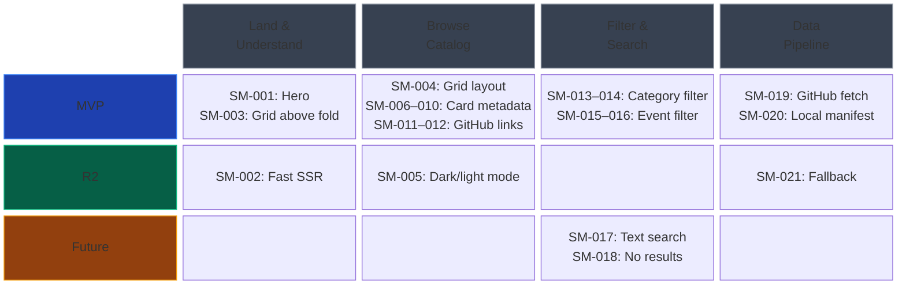

# Story Map: HookHub

> **Primary Persona:** Developer (Claude Code user)
> **Generated from:** .charter/BUSINESS-CASE.md
> **Generated on:** 2026-02-01
> **Methodology:** Jeff Patton's User Story Mapping

---

## Quick Reference

### Release Overview

| Activity | Task | MVP | R2 | Future |
|----------|------|-----|----|----|
| **Land & Understand** | View landing page | SM-001: Landing hero | SM-002: Fast SSR load | — |
| | See hook grid preview | SM-003: Grid above fold | — | — |
| **Browse Catalog** | View hook grid | SM-004: Responsive grid | SM-005: Dark/light mode | — |
| | Scan hook cards | SM-006–010: Full card metadata | — | — |
| | Access hook source | SM-011: GitHub link, SM-012: Link validation | — | — |
| **Filter & Search** | Filter by purpose category | SM-013: Category filter, SM-014: All reset | — | — |
| | Filter by lifecycle event | SM-015: Event filter, SM-016: All reset | — | — |
| | Search by text | — | — | SM-017: Text search, SM-018: No-results state |
| **Data Pipeline** | Enrich hook data | SM-019: GitHub fetch, SM-020: Local manifest | SM-021: Graceful fallback | — |

### Release Summary

| Release | Stories | Delivers |
|---------|---------|----------|
| **MVP** | 15 | Developer can land, understand HookHub's purpose, browse a responsive grid of hooks with full metadata, filter by category and lifecycle event, and click through to GitHub repos. Data enriched from GitHub API at build time. |
| **R2** | 3 | Fast server-rendered load (< 2s), graceful build fallback if GitHub API unavailable, dark/light mode support. |
| **Future** | 2 | Real-time text search across hook names and descriptions with empty-state handling. |

---

## Visual Story Map

Activities across the top, release slices down the left. Read left-to-right for the journey, top-to-bottom for priority.

---

## Detailed Map

### Activity 1: Land & Understand

**Goal:** First-time visitor grasps what HookHub is and sees the catalog immediately
**Persona:** Developer
**Source:** BR-05, BR-07

#### Task 1.1: View landing page

The developer arrives at HookHub and sees a clear hero section that communicates the site's purpose within 5 seconds.

| Release | Stories |
|---------|---------|
| **MVP** | SM-001: Clear landing hero communicates site purpose (BR-05) |
| **R2** | SM-002: Fast server-rendered initial load under 2 seconds (BR-07) |

#### Task 1.2: See hook grid preview

The hook grid is visible without scrolling on desktop, so visitors immediately see content.

| Release | Stories |
|---------|---------|
| **MVP** | SM-003: Hook grid visible above the fold on desktop (BR-05) |

---

### Activity 2: Browse Catalog

**Goal:** Developer scans the full catalog of hooks and accesses their source
**Persona:** Developer
**Source:** BR-01, BR-02, BR-03, BR-08

#### Task 2.1: View hook grid

Hooks are displayed in a responsive grid layout that adapts to mobile, tablet, and desktop viewports.

| Release | Stories |
|---------|---------|
| **MVP** | SM-004: Display hooks in responsive grid layout (BR-01) |
| **R2** | SM-005: Support dark and light display modes (BR-08) |

#### Task 2.2: Scan hook cards

Each hook card shows all required metadata with visually distinct category and lifecycle badges.

| Release | Stories |
|---------|---------|
| **MVP** | SM-006: Show hook name on card (BR-01) |
| | SM-007: Show purpose category with visual distinction (BR-02) |
| | SM-008: Show lifecycle event with visual distinction (BR-02) |
| | SM-009: Show hook description on card (BR-01) |
| | SM-010: Show GitHub stars count on card (BR-01) |

#### Task 2.3: Access hook source

Each card links to the hook's GitHub repository, validated at build time.

| Release | Stories |
|---------|---------|
| **MVP** | SM-011: Clickable link to GitHub repo opens in new tab (BR-03) |
| | SM-012: Validate repo links at build time (BR-03) |

---

### Activity 3: Filter & Search

**Goal:** Developer narrows results to find hooks relevant to their needs
**Persona:** Developer
**Source:** BR-04, BR-09

#### Task 3.1: Filter by purpose category

Primary filter dimension. Developer selects a purpose category (Safety, Automation, Notification, Formatting, Testing, Security, Logging, Custom) to show only matching hooks.

| Release | Stories |
|---------|---------|
| **MVP** | SM-013: Filter hooks by purpose category (BR-04) |
| | SM-014: "All" option resets category filter (BR-04) |

#### Task 3.2: Filter by lifecycle event

Secondary filter dimension. Developer selects a lifecycle event (PreToolUse, PostToolUse, UserPromptSubmit, Notification, Stop) to further narrow results.

| Release | Stories |
|---------|---------|
| **MVP** | SM-015: Filter hooks by lifecycle event (BR-04) |
| | SM-016: "All" option resets lifecycle event filter (BR-04) |

#### Task 3.3: Search by text

Free-text search across hook names and descriptions for quick lookup.

| Release | Stories |
|---------|---------|
| **Future** | SM-017: Real-time text search across names and descriptions (BR-09) |
| | SM-018: "No results" empty state when search matches nothing (BR-09) |

---

### Activity 4: Data Pipeline

**Goal:** Catalog displays live, enriched metadata from GitHub
**Persona:** Developer (indirect — benefits from fresh data)
**Source:** BR-06

#### Task 4.1: Enrich hook data from GitHub

A local manifest file lists curated hook repo URLs. At build time, the GitHub API enriches each entry with live metadata (stars, descriptions, freshness).

| Release | Stories |
|---------|---------|
| **MVP** | SM-019: Fetch live metadata from GitHub API at build time (BR-06) |
| | SM-020: Local manifest file controls which hooks appear (BR-06) |
| **R2** | SM-021: Graceful degradation if GitHub API unavailable (BR-06) |

---

## Walking Skeleton

The walking skeleton provides end-to-end functionality with minimal features:

| Activity | Task | MVP Story | Capability |
|----------|------|-----------|------------|
| Land & Understand | View landing page | SM-001 | Visitor sees hero and understands HookHub's purpose |
| Land & Understand | See hook grid preview | SM-003 | Grid visible without scrolling on desktop |
| Browse Catalog | View hook grid | SM-004 | Responsive grid displays all hooks |
| Browse Catalog | Scan hook cards | SM-006 | Card shows name, category, event, description, stars |
| Browse Catalog | Access hook source | SM-011 | Click through to GitHub repo in new tab |
| Filter & Search | Filter by purpose category | SM-013 | Select a category to narrow results |
| Filter & Search | Filter by lifecycle event | SM-015 | Select a lifecycle event to narrow results |
| Data Pipeline | Enrich hook data | SM-019 | Build fetches live data from GitHub API |

**Walking skeleton delivers:** A developer can land on HookHub, immediately understand its purpose, browse a grid of hooks with full metadata, filter by category and lifecycle event, and click through to any hook's GitHub repository — all backed by live data fetched at build time.

---

## Traceability

| Story ID | Title | BR-XX | Release |
|----------|-------|-------|---------|
| SM-001 | Clear landing hero communicates site purpose | BR-05 | MVP |
| SM-002 | Fast server-rendered initial load (< 2s) | BR-07 | R2 |
| SM-003 | Hook grid visible above the fold on desktop | BR-05 | MVP |
| SM-004 | Display hooks in responsive grid layout | BR-01 | MVP |
| SM-005 | Support dark and light display modes | BR-08 | R2 |
| SM-006 | Show hook name on card | BR-01 | MVP |
| SM-007 | Show purpose category with visual distinction | BR-02 | MVP |
| SM-008 | Show lifecycle event with visual distinction | BR-02 | MVP |
| SM-009 | Show hook description on card | BR-01 | MVP |
| SM-010 | Show GitHub stars count on card | BR-01 | MVP |
| SM-011 | Clickable link to GitHub repo (new tab) | BR-03 | MVP |
| SM-012 | Validate repo links at build time | BR-03 | MVP |
| SM-013 | Filter hooks by purpose category | BR-04 | MVP |
| SM-014 | "All" option resets category filter | BR-04 | MVP |
| SM-015 | Filter hooks by lifecycle event | BR-04 | MVP |
| SM-016 | "All" option resets lifecycle event filter | BR-04 | MVP |
| SM-017 | Real-time text search across names and descriptions | BR-09 | Future |
| SM-018 | "No results" empty state | BR-09 | Future |
| SM-019 | Fetch live metadata from GitHub API at build time | BR-06 | MVP |
| SM-020 | Local manifest file controls which hooks appear | BR-06 | MVP |
| SM-021 | Graceful degradation if GitHub API unavailable | BR-06 | R2 |

**Coverage:** 9/9 BR-XX requirements mapped

---

## Cross-Cutting Concerns

These apply across all activities (from Section 7 Constraints):

| Concern | Impact | Stories Affected |
|---------|--------|------------------|
| Solo developer | All work serialized; scope must stay minimal | All |
| Zero budget (Vercel free tier) | No paid services; hosting limits apply | SM-019 (API rate limits), SM-004 (build size) |
| Next.js 16 + React 19 Server Components | Server-first rendering; client interactivity requires "use client" directive | SM-013–016 (filters need client state), SM-017 (search needs client state) |
| TypeScript strict mode | All code must pass strict type checking | All |
| Read-only site, no auth/DB | No user-generated content; curator controls catalog via manifest | SM-020 (manifest is sole data authority) |

---

## Gaps and Questions

### Open

| # | Gap | Activity | Impact | Resolution |
|---|-----|----------|--------|------------|
| G-01 | SM-021 is BR-06 Must-priority but placed in R2 | Data Pipeline | If GitHub API fails during MVP build, no fallback — must re-run build manually | Pragmatic deferral: MVP works if API is reachable; R2 adds resilience |
| G-02 | No analytics stories on the map | All | Section 6 KPIs (visitors, click-throughs) cannot be measured without analytics | Resolved in business case: analytics deferred to post-MVP (OI-04) |

### Resolved

| # | Gap | Decision |
|---|-----|----------|
| G-03 | Hook card design not specified | **Compact card**: Name as title, category + lifecycle as small badges, 2-line description truncated, stars count, subtle repo link. Dense grid maximizes hooks visible at once. |
| G-04 | Filter interaction pattern undefined | **Toggle chips**: Horizontal row of clickable chips/pills above the grid. One row for purpose categories, one row for lifecycle events. Active chip is highlighted. All options visible at a glance. |
| G-05 | Combined filter behavior not specified | **AND (intersection)**: When both a category and lifecycle event filter are active, show only hooks matching BOTH. Progressive narrowing — most intuitive for drilling down. |

---

## Complementary Artifacts

- **Full story details with acceptance criteria:** Run `/create-requirements` for USER-STORIES.md
- **Architecture:** Run `/create-design-doc` for technical design
- **Execution plan:** Run `/create-execution-plan` for implementation phasing
