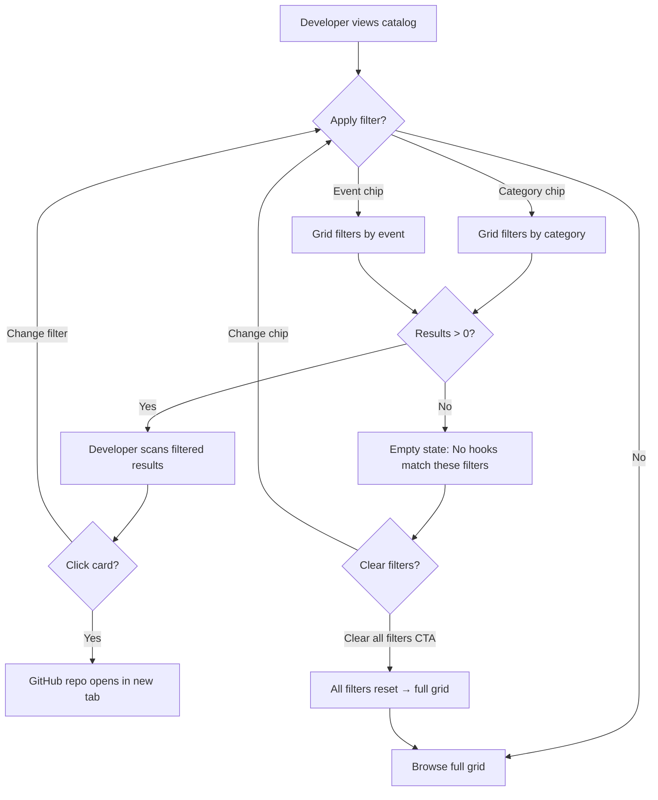

# UX Accessibility, User Flows & Traceability — HookHub

> Part of UX Design Plan. See [UX-DESIGN-PLAN.md](UX-DESIGN-PLAN.md) for overview, IA, hierarchy, and layouts.

---

## Section 9: Accessibility

### Global Requirements

- **Skip link:** "Skip to main content" as first focusable element, targeting `<main id="main-content">`
- **Landmark regions:** `<header>` (hero area), `<main>` (filter bar + grid), `<footer>` — each with descriptive `aria-label`
- **Heading hierarchy:** `<h1>` (hero headline) → `<h2>` ("Hook Catalog" or similar section marker, if needed) → `<h3>` (card titles). No skipped levels. Visual size via CSS only.
- **Focus indicators:** 3:1 contrast minimum, visible on all interactive elements (filter chips, card links)
- **Color independence:** Badge categories distinguished by label text and shape treatment, not color alone. Active filter chips distinguished by fill + text weight, not solely color.
- **Text resize:** All content accessible at 200% zoom without horizontal scroll. Grid reflows to fewer columns.

### Per-Component Accessibility

#### Hero Section

- **HTML element:** `<section aria-labelledby="hero-heading">`
- **ARIA:** None beyond landmark
- **Keyboard:** Skip link bypasses hero to reach `<main>`
- **Focus pattern:** No interactive elements within hero (unless visual cue is a link)
- **Accessible name:** Heading text via `aria-labelledby`
- **Touch target:** N/A

#### Filter Chip Group (Category)

- **HTML element:** `
`
- **ARIA:** Each chip: `role="radio"`, `aria-checked="true|false"`
- **Keyboard:** Roving tabindex. Tab enters group (focus on selected chip or first chip). Arrow Left/Right moves focus. Home/End to first/last. Space/Enter selects focused chip. Tab exits group.
- **Focus pattern:** Roving tabindex — selected chip has `tabindex="0"`, all others `tabindex="-1"`
- **Accessible name:** Group: `aria-label`. Each chip: visible text label.
- **Live region:** N/A on chip group itself; result count handles live announcement.
- **Touch target:** 44x44 min at touch tiers

#### Filter Chip Group (Event)

- Same pattern as Category chip group with `aria-label="Filter by lifecycle event"`

#### Result Count

- **HTML element:** `
`
- **ARIA:** `role="status"` (implies polite live region)
- **Keyboard:** Not focusable (informational only)
- **Accessible name:** Content text (e.g., "Showing 12 hooks")
- **Live region:** `aria-live="polite"`, debounced ~300ms after filter change to avoid announcing intermediate states

#### Hook Card

- **HTML element:** `<article>` in `<li>` within `<ul aria-label="Hook catalog">`
- **ARIA:** `aria-labelledby` pointing to card title `<h3>`
- **Keyboard:** Tab focuses card link (single `<a>` on title, stretched to cover card via `::after`). Enter opens GitHub in new tab.
- **Focus pattern:** Focus return — after opening new tab, focus remains on card when user returns to the page
- **Accessible name:** Card title text via `<h3>`
- **Live region:** None
- **Touch target:** Full card area (well above 44x44)

#### Card Grid

- **HTML element:** `<ul aria-label="Hook catalog">`
- **ARIA:** None beyond `aria-label`
- **Keyboard:** Tab between cards (each card = one tab stop)
- **Accessible name:** `aria-label="Hook catalog"`
- **Live region:** Count announced via result-count `role="status"` region after filter changes

#### Stars Display

- **HTML element:** `` (full number, e.g., "1,200 GitHub stars")
- **ARIA:** `aria-label` provides full unabbreviated count
- **Keyboard:** Not independently focusable (within card article)
- **Accessible name:** `aria-label`

#### Badge (Category / Event)

- **HTML element:** `` with text content
- **ARIA:** None needed — visible text is self-describing
- **Keyboard:** Not focusable (informational within card)
- **Accessible name:** Visible text content

---

## Section 10: User Flows

### Flow: Discover and Browse Hooks (from SM-001, SM-003, SM-004, SM-006–010)

**Entry point:** Developer arrives at HookHub homepage via direct URL or search engine

1. Developer sees hero section → UI: Headline communicates "directory of Claude Code hooks." Subtitle provides brief context. Visual cue points to catalog below.
2. Developer scrolls down (or hero is compact enough to show grid on desktop without scrolling) → UI: Filter bar and hook grid become visible.
3. Developer scans hook cards in the grid → UI: Cards display name, badges (category + event), description (2-line truncated), stars count. Grid is responsive to viewport.
4. Developer identifies an interesting hook → UI: Card hover state provides feedback (elevation/shadow increase).
5. Developer clicks card → UI: GitHub repository opens in new tab.

**Exit point:** GitHub repository page (external site, new tab)

---

### Flow: Filter by Category (from SM-013, SM-014)

**Entry point:** Developer is viewing the unfiltered hook grid

1. Developer clicks a category chip (e.g., "Safety") → UI: Chip transitions to selected state (filled, high emphasis). "All" chip deselects. Grid immediately updates to show only hooks with category "Safety." Result count updates ("Showing N hooks").
2. Developer scans filtered results → UI: Fewer cards visible. Grid layout adjusts.
3. Developer wants to change filter → clicks another category chip (e.g., "Automation") → UI: "Safety" chip deselects. "Automation" selects. Grid updates instantly.
   - **If event filter also active:** Grid shows only hooks matching BOTH active category AND active event (AND logic per G-05).
4. Developer wants to clear category filter → clicks "All" chip → UI: Active category chip deselects. "All" fills. Grid returns to showing all hooks (or all matching event filter if active). Result count updates.

**Exit point:** Developer is viewing filtered or full catalog

---

### Flow: Filter by Lifecycle Event (from SM-015, SM-016)

**Entry point:** Developer is viewing the hook grid (filtered or unfiltered)

1. Developer clicks an event chip (e.g., "PreToolUse") → UI: Chip selected. Grid filters to hooks with that lifecycle event. Result count updates.
   - **If category filter also active:** AND logic — only hooks matching both criteria are shown.
2. Developer reviews filtered results.
3. Developer clicks "All" in event row → UI: Event filter cleared. Grid returns to showing all hooks in the active category (or all hooks if no category filter active).

**Exit point:** Developer is viewing filtered or full catalog

---

### Flow: Zero-Results Recovery (from SM-013, SM-015 / Nielsen H5, H9)

**Entry point:** Developer applies a filter combination that matches zero hooks

1. Developer has both a category and event filter active → UI: Grid area shows empty state: **"No hooks match these filters"** + "Try selecting a different category or event, or reset your filters to see all hooks." + **"Clear all filters"** CTA button.
2. Developer clicks "Clear all filters" CTA → UI: Both "All" chips activate in their respective groups. Grid returns to showing all hooks. Empty state replaced by full grid. Result count updates.
   - **Alternative path:** Developer clicks a different chip in either dimension → UI: Grid updates. If result is non-zero, cards appear. If still zero, empty state persists.

**Exit point:** Developer is viewing a non-empty catalog

---

## Section 11: Traceability Matrix

| UX Element | Plan Section | Source ID | Source Description |
|------------|-------------|-----------|-------------------|
| Hero headline | S1, S3, S4, S5 | SM-001 / US-001 | Clear landing hero communicates site purpose |
| Hero subtitle | S3, S4, S5 | SM-001 / US-001 | Supporting text for purpose communication |
| Hero visual cue | S4, S5 | SM-001 / US-001 | Directs attention to catalog below |
| Grid above-fold visibility | S2, S4, S7 | SM-003 / US-003 | Hook grid visible above fold on desktop |
| Card grid (responsive) | S4, S5, S7 | SM-004 / US-004 | Responsive grid layout (3–4 / 2 / 1 columns) |
| Card title (hook name) | S3, S5 | SM-006 / US-006 | Hook name as card title |
| Category badge | S3, S5 | SM-007 / US-007 | Purpose category with visual distinction |
| Event badge | S3, S5 | SM-008 / US-008 | Lifecycle event with visual distinction |
| Card description | S3, S5 | SM-009 / US-009 | Hook description (2-line truncated) |
| Stars display | S3, S5 | SM-010 / US-010 | GitHub stars count on card |
| Card link to GitHub | S5, S6 | SM-011 / US-011 | Clickable link to GitHub repo (new tab) |
| Build-time link validation | N/A (build) | SM-012 / US-012 | Validate repo links at build time |
| Category filter chips | S5, S6, S9 | SM-013 / US-013 | Filter hooks by purpose category |
| Category "All" chip | S5, S6 | SM-014 / US-014 | "All" option resets category filter |
| Event filter chips | S5, S6, S9 | SM-015 / US-015 | Filter hooks by lifecycle event |
| Event "All" chip | S5, S6 | SM-016 / US-016 | "All" option resets lifecycle event filter |
| Enriched card metadata | S5, S8 | SM-019 / US-019 | GitHub API metadata at build time |
| Manifest-controlled catalog | S5, S8 | SM-020 / US-020 | Local manifest controls which hooks appear |

### Coverage Summary

- **Story map activities in scope:** 16 MVP stories (SM-001, SM-003, SM-004, SM-006–016, SM-019, SM-020)
- **Activities with UX coverage:** 16 (100%)
- **Gaps:** None. SM-012 (build-time link validation), SM-019 (GitHub API fetch), and SM-020 (manifest file) are build-process stories with no direct UX page element. Their effects (enriched data, validated links) are traced to card metadata display and data state handling.

### Nielsen's Heuristic Validation Summary

| Heuristic | Status | Notes |
|-----------|--------|-------|
| H1: Visibility of system status | Pass | Loading skeletons for grid/cards, active chip states, result count updates, feedback timing defined |
| H2: Match between system and real world | Pass | Domain terminology (hooks, category, lifecycle event) matches Claude Code developer vocabulary |
| H3: User control and freedom | Pass | "All" chips for per-dimension reset, URL history for undo, browser back button reverses filter changes |
| H4: Consistency and standards | Pass | Uniform chip pattern for both filter groups, consistent terminology throughout, standard web conventions |
| H5: Error prevention | Pass | Zero-result empty state with recovery guidance, catalog load error state, single-select prevents impossible chip combinations |
| H6: Recognition rather than recall | Pass | All filters visible at all times, active state clearly indicated. _Sev 1: No help text explaining category/event meanings_ |
| H7: Flexibility and efficiency of use | Pass | URL sharing/bookmarking, full keyboard navigation. _Sev 1: No card-badge-to-filter shortcut; no expert accelerators_ |
| H8: Aesthetic and minimalist design | Pass | 5-element card hierarchy, clear emphasis levels, every element traceable to a source requirement |
| H9: Help users recognize, diagnose, recover from errors | Pass | Exact microcopy for all error/empty states, each includes specific recovery action |
| H10: Help and documentation | Pass | Hero communicates purpose. _Sev 2: No first-use onboarding beyond hero. Sev 1: No "What are Claude Code hooks?" link_ |

**Cross-heuristic consistency checks:**
- H1 + H9: Every error state includes both status indication ("Unable to load") and recovery action ("Refresh page") ✓
- H3 + H6: Escape hatches ("All" chips) are always visible in the filter bar ✓
- H4 + H2: Consistent terminology ("category," "event," "chip") is also domain-appropriate ✓
- H5 + H9: Prevention (single-select, always-visible filters) and recovery (clear CTA, refresh) cover the same error types ✓

**Severity 1–2 notes for future attention:**
1. (H6, Sev 1) No contextual help text explaining what purpose categories or lifecycle events mean. Consider tooltips or a brief glossary for developers unfamiliar with Claude Code hook types.
2. (H7, Sev 1) No cross-component shortcuts — e.g., clicking a category badge on a card could auto-apply that category filter. Consider for R2.
3. (H7, Sev 1) No expert shortcuts or keyboard accelerators beyond standard Tab/Arrow. Appropriate for MVP simplicity.
4. (H10, Sev 2) No first-use onboarding beyond the hero. A brief one-time tooltip explaining filter behavior could help new visitors. Low priority for a simple directory.
5. (H10, Sev 1) No "What are Claude Code hooks?" explanatory link for developers who arrive without prior context.
