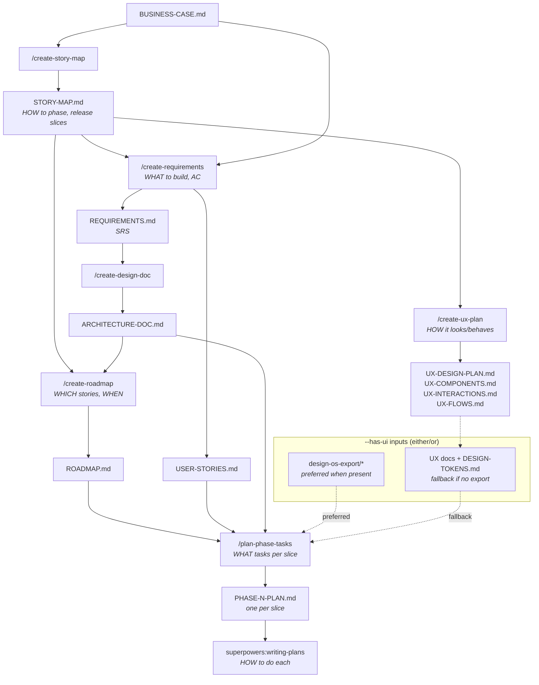
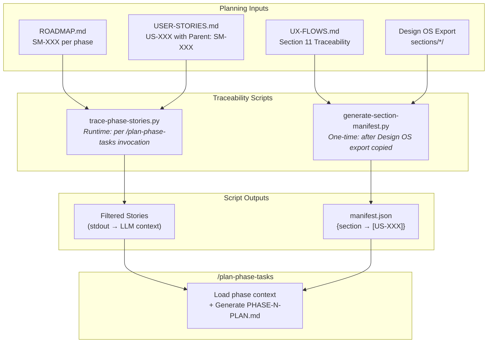

# Skill Design: /plan-phase-tasks

**Date:** 2026-01-28
**Status:** Ready to build next session
**Location:** `~/.claude/plugins/marketplaces/claude-forge/skills/plan-phase-tasks/`

> **Note:** This is a design specification — it defines the goal, philosophy, inputs, outputs, and key decisions for the `/plan-phase-tasks` skill. It is NOT the skill itself. The actual SKILL.md should be built using the `create-agent-skill` skill, which will structure the phases, interaction model, and best practices. This document serves as the guiding context for that build process.

> **Two-Leg Structure:** This document covers BOTH skills that replaced the monolithic `/create-execution-plan`:
> - **Leg 1: `/create-roadmap`** (BUILT) — Sections "Context" through "Key Design Decisions" describe this skill's design. These sections are preserved as **context** for Leg 2 builders, since they explain the upstream artifact format.
>
> **Naming convention:** Slash command: `/create-roadmap` (singular). Skill identifier: `claude-forge:create-roadmaps` (plural). Leg 2 slash command: `/plan-phase-tasks`. Skill identifier: `claude-forge:plan-phase-tasks`. Use the slash command form throughout this spec.
> - **Leg 2: `/plan-phase-tasks`** (TO BUILD) — Section "Relationship to /plan-phase-tasks" is the primary specification. The "Integration Research" section and "Prior Methodology Research" appendix also serve Leg 2.
>
> **If you are building `/plan-phase-tasks`, start at "Relationship to /plan-phase-tasks" (the Leg 2 spec). Read earlier sections only for pipeline context.**

---

## ═══ Leg 1: /create-roadmap (BUILT) ═══

---

## Context

This session also built `/create-story-map` skill — a complementary skill to `/create-requirements` that transforms BUSINESS-CASE.md into journey-organized story maps with release slices.

The discussion revealed how `/create-story-map` fits into the execution planning pipeline:
- `/create-story-map` produces journey-organized map (Activity → Task → Story with release slices) — consumed by `/create-roadmap`
- `/create-requirements` produces detailed user stories with AC — when STORY-MAP.md is provided as input, each US-XXX traces to exactly one SM-XXX parent, creating explicit lineage
- The two skills are sequential when a story map exists: story map first, then requirements derived from it
- This pipeline (`/create-roadmap` + `/plan-phase-tasks`) replaces the monolithic `/create-execution-plan` skill, which combined roadmap-level and phase-level planning into a single output

---

## The Full Skills Pipeline

> **All pipeline artifacts live under `.charter/`.** Document names below omit the path prefix for readability.



> \* **Design OS** is run manually in a separate session. Its instruction files (`instructions/incremental/*.md`) and section docs (`sections/*/README.md`, `tests.md`, `types.ts`) are reference material for implementation — not loaded at planning time, but referenced by path in PHASE-N-PLAN.md task descriptions. `superpowers:writing-plans` loads these materials when generating TDD implementation steps. TSX prototypes are also referenced by path only (not production code). Export copied to `.charter/design-os-export/`.

> **Terminology:** Each **slice** in the roadmap becomes one **phase** for `/plan-phase-tasks`, producing one `PHASE-N-PLAN.md`. Phases are numbered sequentially across the entire roadmap (not reset per release). Example: MVP has 3 slices → PHASE-1 through PHASE-3. R2 has 2 slices → PHASE-4 through PHASE-5. Future has 1 slice → PHASE-6.

---

## Skill Specification

### Purpose

Transform story map + architecture doc into a phased roadmap with vertical slices, such that each slice delivers end-to-end user value.

This is a **generic, reusable skill** — it works with any project's charter documents, not a specific project.

### Inputs

| Input | From Skill | Key Content |
|-------|------------|-------------|
| **STORY-MAP.md** | `/create-story-map` | Release slices (as defined by the map), walking skeleton, journey coherence, SM-XXX IDs, BR-XX traceability |
| **ARCHITECTURE-DOC.md** | `/create-design-doc` | Domain model, layers, dependencies, interfaces, constraints |

**Note:** USER-STORIES.md is NOT an input to this skill. Detailed acceptance criteria, sizing, and US-XXX IDs are consumed by the downstream `/plan-phase-tasks` skill, which breaks stories into implementable tasks. When `/create-requirements` derives user stories from STORY-MAP.md, each US-XXX has an explicit SM-XXX parent, enabling clean traversal downstream.

### Output

**`.charter/ROADMAP.md`** (~200-400 lines) containing:
- Releases (read from the story map's release slices — the number and names vary per project)
- Vertical slices within each release (deliverable chunks, not months-long)
- Wave groupings within each release (which slices can execute in parallel vs. must be sequential)
- Stories assigned to each slice (SM-XXX IDs with BR-XX source)
- Release transitions and dependencies
- Definition of Done per release

### Output Structure

*Illustrative example — actual releases and stories come from the project's story map:*

> **Terminology:** Headings use `#### PHASE-N:` format. Each phase = one slice (see line 78). Phase numbers are sequential across the entire roadmap.

```
.charter/ROADMAP.md
├── Release: [First release from story map]
│   ├── Transitions (Produces / Requires / Unlocks)
│   ├── Wave 1 (sequential — foundation)
│   │   └── #### PHASE-1: [Walking skeleton — minimal end-to-end journey]
│   │       └── SM-XXX (BR-XX), SM-XXX (BR-XX)
│   ├── Wave 2 (parallel — independent slices)
│   │   ├── #### PHASE-2: [Extends a specific activity with depth]
│   │   │   └── SM-XXX (BR-XX), SM-XXX (BR-XX)
│   │   └── #### PHASE-3: [Completes another activity area]
│   │       └── SM-XXX (BR-XX), SM-XXX (BR-XX)
│   ├── Wave 3 (sequential — depends on Wave 2)
│   │   └── #### PHASE-4: [Integrates outputs from PHASE-2 + PHASE-3]
│   │       └── SM-XXX (BR-XX)
│   └── Definition of Done
├── Release: [Second release from story map]
│   ├── Transitions
│   ├── Wave 1:
│   │   └── #### PHASE-5: ...
│   ├── Wave 2:
│   │   └── #### PHASE-6: ...
│   └── Definition of Done
├── Release: [Third release from story map]
│   └── ...
└── Release: [Final / Future]
    └── (deferred phases)
```

*HookHub example: Releases are MVP, R2, Future as defined in the story map. Wave 1 contains PHASE-1 "Walking Skeleton" with SM-001 (BR-05), SM-004 (BR-01), SM-013 (BR-04), SM-019 (BR-06). Wave 2 runs PHASE-2 "Rich Card Metadata" and PHASE-3 "Filter & Data Pipeline Polish" in parallel since they don't depend on each other.*

---

## Key Design Decisions

### 1. Release Granularity: Match Story Map Releases

Releases are read from the story map input — the skill does not prescribe how many releases exist or what they're called. The story map may define 2 releases or 6; the skill adapts.

**Within each release**, break into **vertical slices** that deliver incrementally. Each slice is days/weeks, not months.

**Rationale:** Story map already did the release slicing work. Don't duplicate effort. The skill's job is to break releases into deliverable chunks and validate technical feasibility.

*HookHub example: Story map defines MVP, R2, Future — three release levels.*

### 2. Story ID Handling: SM-XXX with BR-XX Source

The roadmap uses **SM-XXX IDs** (from the story map) with their **BR-XX source** throughout. No SM-XXX ↔ US-XXX cross-reference table.

**Rationale:**
- SM-XXX IDs are already organized by release in the story map — natural fit for a roadmap
- When `/create-requirements` is run with STORY-MAP.md as input, each US-XXX traces to exactly one SM-XXX parent — creating explicit lineage (see Fix 1 in review)
- The downstream `/plan-phase-tasks` skill reads USER-STORIES.md directly for AC and sizing, and can traverse SM-XXX → US-XXX through this explicit parent-child link

### 3. Location: claude-forge Plugin

Alongside `/create-requirements`, `/create-story-map`, `/create-design-doc`.

**Rationale:** Same skill family, same plugin.

### 4. Output Size: ~200-400 Lines

Per the refactor proposal (RC-8), keep output small to prevent LLM attention degradation.

### 5. Reconciliation and Ordering Logic

The story map provides release slices from a **user journey** perspective. The architecture doc may reveal **technical dependencies** that require adjustment. The skill must reconcile these two views.

**The skill must:**
1. Start with the story map's release slices as baseline
2. Read architectural dependencies (domain model, layer structure, external interfaces)
3. Order slices within each release so that foundational work precedes work that depends on it
4. Adjust slice boundaries if needed (move stories between slices *within the same release* when dependencies require it). If a technical dependency requires cross-release movement, flag it to the user rather than moving silently.
5. Flag conflicts to the user: "Story SM-XXX depends on infrastructure from SM-YYY; recommend reordering"
6. Validate business constraints from cross-cutting concerns against wave groupings (e.g., API budget limits concurrent enrichment work, external dependencies gate specific slices)

**Ordering principle within a release:**

The architecture doc typically defines layers with a dependency rule (e.g., inner layers before outer layers in Clean Architecture: Domain first, then Application, then Infrastructure/Adapters). The skill should ensure:
- Slices that establish domain foundations come before slices that build features on those foundations
- The walking skeleton slice includes minimal representatives from all necessary layers
- External service setup (API connections, third-party integrations) is placed before features that consume those services

Note: This does NOT mean "build all domain, then all application, then all infrastructure" — that would be horizontal slicing. Each vertical slice may touch multiple layers, but the *ordering* of slices should respect which foundations must exist first.

*HookHub example: The GitHub API adapter must be set up before enrichment features that fetch stars, descriptions, and freshness data through it.*

### 6. Release Transitions

Each release in ROADMAP.md must specify:
- **Produces:** What this release delivers that the next release depends on
- **Requires:** What must exist from prior releases (none for the first release)
- **Unlocks:** What becomes possible after this release

This prevents orphaned work and ensures the pipeline flows.

*Illustrative example:*
```
Release 1 produces: Core domain entities + primary platform adapter + basic UI
Release 2 requires: Core domain entities from Release 1
Release 2 produces: Advanced features + secondary adapters
Release 2 unlocks: Release 3 can build on the infrastructure established here
```

### 7. Definition of Done Per Release

Each release must have a Definition of Done. The skill should prompt the user to define DoD criteria covering:
- Functional completeness (which AC must pass)
- Test coverage expectations (domain, application, integration layers)
- End-to-end verification (the slice works as a whole)
- Deployment readiness

The specific thresholds are project decisions — the skill ensures DoD gets defined, not what the numbers should be.

### 8. Selective Section Reading (Progressive Loading)

The two input documents can total 1,000+ lines combined (HookHub example: ~1,500 lines). The skill must NOT read entire files into context. Instead, it uses **progressive loading** — targeted `Read` calls with `offset` and `limit` parameters to load only the sections it needs.

**Mechanism:**

1. **Scan for section headers:** Use `Grep` to find line numbers of markdown headings (e.g., `## Quick Reference`, `## Domain Model`) in each input file
2. **Read only needed sections:** Use `Read(file, offset=X, limit=Y)` to load specific line ranges — only those lines enter the context window
3. **Skip everything else:** Sections not in the "Needed" column below never enter context at all

This works because both inputs are generated from **known templates** with predictable section headers.

> **Granularity:** When a top-level section (`##`) is listed, read from its header through all subsections (`###`, `####`) until the next `##` header. For example, "Domain Model" means reading from `## 3. Domain Model` through all entity definitions until `## 4. Architecture Layers`. When a specific subsection (`###`) is listed (e.g., "External Interfaces"), read only that subsection until the next `###` or `##` header.

**Sections to read per input** (to be refined after reviewing each skill's templated output):

| Input | Sections Needed | Sections Skipped |
|-------|----------------|------------------|
| **STORY-MAP.md** | Quick Reference (contains Release Overview subsection), Walking Skeleton, Traceability, Cross-Cutting Concerns, Gaps and Questions | Visual Story Map (Mermaid diagram), Detailed Map |
| **ARCHITECTURE-DOC.md** | Domain Model, Architecture Layers, External Interfaces (`###` subsection under System Context), Constraints | C4 diagrams, ADRs, full implementation details |

**Rationale:** RC-8 applies to inputs too — not as output degradation, but as context pressure and attention dilution. Progressive loading brings ~300-500 lines of targeted sections into context instead of ~1,500+ lines. Lines not loaded via `Read` never enter the context window.

### 9. Jira Compatibility (Deferred)

The ROADMAP.md output must be structured so a downstream export to Jira is possible. However, Jira export is NOT built into this skill — it's a separate concern (Single Responsibility).

**Deferred to:** A separate export step (script or skill) that reads ROADMAP.md + `.charter/PHASE-N-PLAN.md` and produces a Jira-importable CSV.

**Entity mapping** (from execution plan methodology research):

| Roadmap Concept | JIRA Entity |
|-----------------|-------------|
| Release (MVP, R2...) | Fix Version |
| Vertical Slice | Epic or Label |
| Story (SM-XXX / US-XXX) | Story |
| Task | Sub-task |
| Acceptance Criteria | AC field or Checklist |

**Research needed:** Confirm Jira CSV bulk import format, field mapping, and whether Fix Versions can be auto-created. See "Prior Methodology Research" appendix below for JIRA integration strategy findings.

### 10. Wave-Based Parallelism

Slices within a release are grouped into **waves**. Slices in the same wave have no dependencies on each other and can be executed in parallel (by parallel agents). Slices in later waves depend on outputs from earlier waves.

**The skill must:**
1. After ordering slices (Decision 5), analyze inter-slice dependencies within each release
2. Group independent slices into the same wave
3. Assign sequential wave numbers: Wave 1 executes first, Wave 2 after Wave 1 completes, etc.
4. Wave 1 contains foundational slices that other slices depend on (for the first release, this is the walking skeleton; for later releases, this is whatever infrastructure or setup work must precede feature slices)
5. Label each wave as `parallel` (multiple slices, no mutual dependencies) or `sequential` (single slice or dependency chain)

**Rationale:** The execution model uses parallel AI agents (via `superpowers:dispatching-parallel-agents`). To maximize throughput, the roadmap must make parallelism explicit — a flat ordered list of slices forces sequential execution even when slices are independent. Wave grouping enables the downstream execution to dispatch multiple agents simultaneously.

**What this skill owns vs. what `/plan-phase-tasks` owns:**

| Parallelism Level | Skill | What it captures |
|---|---|---|
| **Slices within a release** | `/create-roadmap` | Wave grouping — which slices can run simultaneously |
| **Stories/tasks within a slice** | `/plan-phase-tasks` | Which stories are independent (INVEST "I") and assignable to parallel agents |

*HookHub example: MVP Wave 1 = Walking Skeleton (Land & Understand → Browse Catalog → Filter & Search → Data Pipeline). MVP Wave 2 = "Rich Card Metadata" + "Filter & Data Pipeline Polish" in parallel (independent slices).*

---

## What Each Input Contributes

### From STORY-MAP.md (Journey Perspective)

| Content | How Roadmap Uses It |
|---------|---------------------|
| Release slices (as defined by the map) | Release boundaries are pre-defined |
| Walking skeleton | Knows what MUST be in first slice |
| Journey coherence | Won't split a journey across slices |
| Activity groupings | Natural work boundaries |
| BR-XX traceability | Links stories to business requirements |

### From ARCHITECTURE-DOC.md (Technical Perspective)

| Content | How Roadmap Uses It |
|---------|---------------------|
| Domain model dependencies | Entity A needs Entity B first |
| Layer dependencies | Inner layers first (Domain → Application → Adapters) |
| External interface dependencies | API setup before features using it |
| Constraints | Technical blockers to slice ordering |

---

## ═══ Leg 2: /plan-phase-tasks (TO BUILD) ═══

---

## Relationship to /plan-phase-tasks

**Phase = Slice.** Each slice in the roadmap becomes one phase for `/plan-phase-tasks`, producing one `.charter/PHASE-N-PLAN.md` per slice. Phases are numbered sequentially across the entire roadmap (not reset per release).

**Invocation model:** The skill is invoked once per phase, accepting a phase number argument and an optional `--has-ui` flag (e.g., `/plan-phase-tasks 1` or `/plan-phase-tasks 5 --has-ui`). Each invocation is self-contained — it reads the shared upstream artifacts (ROADMAP.md, USER-STORIES.md, ARCHITECTURE-DOC.md, UX docs if `--has-ui` is set) and produces one PHASE-N-PLAN.md. The skill does not consult earlier PHASE-N-PLAN.md files; each phase is planned independently from the shared upstream artifacts, not from sibling phase plans. This means phases within the same wave can be planned in parallel by dispatching multiple agents (e.g., `/plan-phase-tasks 2` and `/plan-phase-tasks 3` simultaneously for Wave 2 phases). The skill does not accept ranges or batch multiple phases — one invocation, one phase, one output file. It does not check whether prerequisite phases (earlier waves) have been planned; wave ordering is enforced by the human or orchestrating agent, not by this skill.

**The `--has-ui` flag:** When present, the skill loads UX documents (UX-DESIGN-PLAN.md, UX-COMPONENTS.md, UX-INTERACTIONS.md, UX-FLOWS.md), DESIGN-TOKENS.md, and Design OS export (if it exists). When absent, all UX inputs are skipped. The invoker determines whether a phase has UI stories — the skill does not attempt to auto-detect this. This is deliberate: the UX-FLOWS.md traceability matrix may not cover all releases (e.g., UX plans scoped to MVP won't include R2/Future stories), making auto-detection unreliable. An explicit flag eliminates false negatives.

| Aspect | /create-roadmap | /plan-phase-tasks |
|--------|----------------------|-------------------|
| **Question** | WHICH stories, WHEN? | WHAT tasks for this slice/phase? |
| **Input** | STORY-MAP.md + ARCHITECTURE-DOC.md | `.charter/ROADMAP.md` + USER-STORIES.md + ARCHITECTURE-DOC.md + UX docs* + DESIGN-TOKENS.md* + Design OS export* |
| **Output** | `.charter/ROADMAP.md` (~200-400 lines) | `.charter/PHASE-N-PLAN.md` (~150-400 lines, one per slice; larger phases like walking skeleton with 8 stories trend toward the upper bound) |
| **Granularity** | Releases → Waves → Slices → Stories | Stories → Tasks with I/O/Test |
| **Parallelism** | Wave grouping (which slices run in parallel) | Story/task independence (which stories run in parallel within a slice) |
| **Execution** | N/A (planning output) | PHASE-N-PLAN.md → `superpowers:writing-plans` → `superpowers:executing-plans` |

\* **Conditional inputs:** UX documents (UX-DESIGN-PLAN.md, UX-COMPONENTS.md, UX-INTERACTIONS.md, UX-FLOWS.md), DESIGN-TOKENS.md, and Design OS export (`.charter/design-os-export/`) are loaded only when the `--has-ui` flag is provided. Data pipeline or build-process phases omit the flag and skip these inputs. Design OS export provides TSX prototypes as visual reference — not production code, not starter code. See Progressive Loading below.

### Story Trace Script: ROADMAP → USER-STORIES

The traversal from ROADMAP.md (SM-XXX IDs per phase) to USER-STORIES.md (US-XXX stories with `**Parent:** SM-XXX`) is a deterministic text-matching operation — not an LLM task. A companion script handles this, keeping the LLM focused on task decomposition.

**Script:** `scripts/trace-phase-stories.py` (co-located in the skill folder)

**Interface:**
```
python3 trace-phase-stories.py <phase-number> <roadmap-path> <user-stories-path>
```

**What it does:**
1. Parses ROADMAP.md for the target phase's SM-XXX IDs
2. Single-pass searches USER-STORIES.md for stories where `**Parent:** SM-XXX` matches
3. Outputs structured markdown with:
   - Header containing `**SM-XXX IDs in this phase:**` and `**US-XXX IDs in this phase:**` (machine-parseable for manifest lookup)
   - Full story blocks with AC
   - Trace summary with coverage stats
4. Reports missing SM-XXX IDs (no matching US-XXX) as warnings

**How the skill uses it:** In an early phase, the skill runs the script via Bash, then reads its stdout as the filtered user stories input. The LLM never searches USER-STORIES.md directly. The script is co-located with the skill at `scripts/trace-phase-stories.py` — the SKILL.md must resolve the script's absolute path relative to its own installation directory (e.g., by discovering the plugin path at runtime).

**Verified:** Tested against all 6 HookHub phases — 21/21 stories traced, zero missing. 114 pytest unit tests covering edge cases (one-to-many, missing SMs, exact matching, boundary detection, US-XXX ID extraction, invariants, malformed input, real-world scenarios, stress tests, format variations, regressions).

**Parsing US-XXX IDs for manifest lookup:** The skill parses the `**US-XXX IDs in this phase:**` line from the script output (regex: `\*\*US-XXX IDs in this phase:\*\* (.*)`) and splits by whitespace to get the list of US-XXX IDs for querying manifest.json.

**Format contracts:** The script depends on two upstream format conventions:

1. **ROADMAP.md:** Expects `#### PHASE-N:` headings (h4 level) for phase entries, as produced by `/create-roadmap`.
2. **USER-STORIES.md:** Expects `**Parent:** SM-XXX` format for story-to-map traceability, as produced by `/create-requirements` (see line 544 of that skill's template and line 745 of its validation checklist).

If either upstream skill's format changes, this script must be updated to match.

### Progressive Loading for /plan-phase-tasks

The input documents can be large (HookHub example: ~2,400+ lines combined across all inputs). The skill must use the same progressive loading approach as Decision 8 (Leg 1) — targeted `Read` calls, not full-file ingestion.

**Per-phase loading strategy:**

| Input | Condition | What to Load | What to Skip |
|-------|-----------|-------------|--------------|
| **ROADMAP.md** | Always | Quick Reference, the target phase's `#### PHASE-N:` block plus its containing `### Wave` header and the parent release's Transitions and Definition of Done, Cross-Release Dependencies | Other releases and sibling phases in other waves |
| **USER-STORIES.md** | Always | **Handled by `trace-phase-stories.py`** — script outputs only the matching US-XXX stories. LLM reads script output, not the file directly. | All other epics and stories |
| **ARCHITECTURE-DOC.md** | Always | Domain Model, Architecture Layers, External Interfaces (`###` subsection under System Context), Key Interfaces, Constraints | C4 diagrams, ADRs, Quality Attributes, full implementation details |
| **Design OS export** | `--has-ui` AND export exists (preferred) | **Reference by path only** — use `manifest.json` to identify relevant sections, then include section paths (e.g., `design-os-export/sections/hook-catalog/`) in task `Reference:` fields. `superpowers:writing-plans` loads these at implementation time. **Supersedes UX docs and DESIGN-TOKENS.md.** | All Design OS content (instruction files, section docs, TSX prototypes) — referenced, not loaded at planning time |
| **UX-DESIGN-PLAN.md** | `--has-ui` AND export **not** available (fallback) | Page layout wireframes for pages affected by the phase's stories | Other pages, IA overview, scanning patterns |
| **UX-COMPONENTS.md** | `--has-ui` AND export **not** available (fallback) | Component specs (atoms, molecules, organisms) referenced by the phase's US-XXX stories | Components not touched by this phase |
| **UX-INTERACTIONS.md** | `--has-ui` AND export **not** available (fallback) | Interaction patterns and responsive specs for affected components; data states for affected UI elements | Unrelated interaction patterns, breakpoint strategy (global) |
| **UX-FLOWS.md** | `--has-ui` AND export **not** available (fallback) | Accessibility specs for affected components; user flows involving the phase's stories | Unrelated flows, traceability matrix (Section 11 — used as lookup to identify relevant sections, then discarded from planning context) |
| **DESIGN-TOKENS.md** | `--has-ui` AND export **not** available (fallback) | **Load entire file** — manually provided input containing spacing, typography, color tokens | N/A — no progressive loading |

**Mechanism:** ROADMAP.md and ARCHITECTURE-DOC.md use Decision 8's approach (Grep for headers, Read with offset/limit). USER-STORIES.md is pre-filtered by the trace script — the skill runs `trace-phase-stories.py` and reads its stdout. When `--has-ui` is set, the skill first checks whether `.charter/design-os-export/` exists. If it does, use `manifest.json` to identify which sections contain the phase's stories, then include those section paths in task `Reference:` fields — the skill does NOT load Design OS content at planning time. The UX docs and DESIGN-TOKENS.md are skipped because the export already distills their content. `superpowers:writing-plans` loads the referenced Design OS materials at implementation time. If the export does not exist, fall back to loading UX docs using the algorithm below. For a single phase, total context is a small fraction of the combined document size.

**UX docs fallback algorithm (when Design OS export not available):**

1. **Lookup step:** Load UX-FLOWS.md Section 11 (traceability matrix) to find which UX elements map to the phase's US-XXX story IDs (from trace script output)
2. **Identify sections:** Use those mappings to determine which pages, components, interactions, and flows are affected
3. **Load filtered content:** Load only the identified sections from UX-DESIGN-PLAN.md, UX-COMPONENTS.md, UX-INTERACTIONS.md (plus accessibility specs from UX-FLOWS.md), and full DESIGN-TOKENS.md
4. **Discard lookup:** Section 11 itself is not included in the final planning context — it was used for discovery only

**Wave metadata extraction:** The `trace-phase-stories.py` script outputs user stories only — it does not extract wave information. To populate the Metadata section's `**Wave:**` field, the skill extracts the wave number and label from the `### Wave` header that was already loaded during progressive loading (see ROADMAP.md row above — the phase block plus its containing wave header are loaded together). This is a simple regex extraction from already-loaded content, not a separate file read.

**ROADMAP.md format contract** (from `/create-roadmap` output):

```
Wave headers:    ### Wave N (type -- description)
Phase headers:   #### PHASE-N: Slice Name
```

Examples:
- `### Wave 1 (sequential -- foundation)`
- `### Wave 2 (parallel -- independent enhancements)`
- `#### PHASE-1: Walking Skeleton -- End-to-End Hook Browsing`
- `#### PHASE-2: Rich Card Metadata`

Parsing patterns:
- Wave: `^### Wave (\d+) \(([^)]+)\)` → captures wave number (group 1) and full label (group 2)
- Phase: `^#### PHASE-(\d+):` → captures phase number (group 1)

**UI input control:** The `--has-ui` flag determines whether UI-specific inputs are loaded. The skill does not auto-detect UI stories. See the invocation model section above for rationale.

**Traceability fallback (UX docs path only):** The UX-FLOWS.md traceability matrix may not cover non-MVP stories (e.g., R2/Future). If `--has-ui` is set, the export doesn't exist, and the traceability matrix yields no matching UX sections for the phase's story IDs, the skill should **skip UX docs entirely** rather than loading unbounded content. Note this in the Metadata section: `UX Inputs Loaded: No — traceability matrix has no entries for this phase's stories; UX patterns deferred to superpowers:writing-plans`. This preserves the progressive loading guarantee (Decision 8) — the downstream `superpowers:writing-plans` can research relevant UX patterns when generating TDD steps for specific UI tasks.

### Design OS Export: Expected Template Structure

The Design OS export is an external tool's output placed at `.charter/design-os-export/`. It follows a predictable, templated directory structure. The skill must understand this structure to discover and load relevant sections per phase. When the export exists, it is the **preferred UI input** for `/plan-phase-tasks`, superseding the UX docs and DESIGN-TOKENS.md (which were the inputs Design OS consumed to produce the export). The export's markdown instruction files, section docs, and TSX prototypes are all reference material — referenced by path in PHASE-N-PLAN.md task descriptions, loaded by `superpowers:writing-plans` at implementation time. TSX files are structural prototypes, not production code.

**Root directory:**

```
.charter/design-os-export/
├── README.md                          # How-to-use guide (incremental vs one-shot build)
├── product-overview.md                # Product summary, data model overview, design system summary, implementation sequence
├── data-model/
│   ├── README.md                      # Data model documentation
│   ├── types.ts                       # TypeScript type definitions for core entities
│   └── sample-data.json               # Mock data for development
├── design-system/
│   ├── tokens.css                     # CSS custom properties (light/dark mode token values)
│   ├── fonts.md                       # Font family specifications
│   └── tailwind-colors.md             # Tailwind color palette mappings
├── instructions/
│   ├── one-shot-instructions.md       # All milestones combined
│   └── incremental/
│       └── NN-<section-id>.md         # One instruction file per milestone (01-foundation, 02-section, ...)
├── prompts/
│   ├── one-shot-prompt.md             # Full implementation prompt template
│   └── section-prompt.md             # Per-section prompt template
├── shell/
│   ├── README.md                      # Layout pattern, responsive behavior, design notes
│   ├── screenshot.png                 # Visual reference for the application shell
│   └── components/
│       └── *.tsx                       # Shell component prototypes (root wrapper, header, footer)
└── sections/
    └── <section-id>/                  # One directory per UI section
        ├── README.md                  # Section overview: user flows, design decisions, component list, callback props
        ├── screenshot.png             # Visual reference (may have variants: screenshot-dark.png, screenshot-light.png)
        ├── tests.md                   # Framework-agnostic test instructions (WHAT to test, not HOW)
        ├── types.ts                   # Section-specific TypeScript interfaces
        ├── sample-data.json           # Mock data for the section
        ├── components/
        │   └── *.tsx                  # Component prototypes (structural/layout reference, not production code)
        └── hooks/                     # (optional) Custom hook prototypes
            └── *.ts
```

**Key conventions:**

1. **Section directories are named by kebab-case ID** (e.g., `landing-and-hero`, `hook-catalog`, `filter-system`). The skill discovers available sections by listing directories under `sections/`.
2. **Each section follows the same file pattern.** `README.md`, `screenshot.png`, `tests.md`, `types.ts`, `sample-data.json`, and `components/` are present in every section. `hooks/` is optional.
3. **Section README.md is the primary reference** per section — it describes user flows, design decisions, component inventory, and callback props. Referenced by path in task descriptions; loaded by `superpowers:writing-plans` at implementation time.
4. **TSX files are structural prototypes.** They show component composition, prop interfaces, layout patterns, and Tailwind class usage. They are NOT production code — the implementation agent adapts them to the project's architecture (e.g., Next.js App Router vs. Vite SPA).
5. **tests.md provides test guidance.** Each section's `tests.md` describes user flow tests, component interaction tests, edge cases, and accessibility checks — all framework-agnostic. These supplement the FDD task decomposition's `Test:` field.
6. **The `instructions/incremental/` files define a build order.** File `01-foundation.md` covers design tokens, data model, routing, and shell. Subsequent files (`02-*.md`, `03-*.md`, etc.) cover individual sections. This order is informational — the skill's phase ordering comes from ROADMAP.md, not from the export.
7. **Design OS export is authoritative when present.** The export's `design-system/` directory contains token values (colors, spacing, typography) that Design OS generated from its inputs. When the export exists, these values are authoritative — the skill does NOT load `.charter/DESIGN-TOKENS.md` separately or attempt to reconcile differences. DESIGN-TOKENS.md is only used as a fallback input when the export does not exist.

**How the skill uses the export per phase:**

1. **Check existence:** Only reached when `--has-ui` flag is set. If `.charter/design-os-export/` exists, use it (preferred path). Note in metadata: `UX Inputs Loaded: Yes — Design OS export (sections: landing-and-hero, hook-catalog, filter-system)`. If the export does NOT exist, skip it and load UX docs as fallback. Note in metadata: `UX Inputs Loaded: Yes — UX-DESIGN-PLAN.md, UX-COMPONENTS.md, UX-INTERACTIONS.md, UX-FLOWS.md, DESIGN-TOKENS.md (filtered via traceability matrix); Design OS export not available`.
2. **Match sections to stories via manifest:** The `trace-phase-stories.py` script (run earlier in progressive loading) outputs the US-XXX story IDs for this phase. Read `.charter/design-os-export/manifest.json` to look up which section directories contain those US-XXX IDs. If `manifest.json` does not exist, the skill automatically generates it by running `generate-section-manifest.py` (co-located in the skill's `scripts/` folder). If generation fails (e.g., missing `OPENAI_API_KEY`), emit a clear error: "Design OS export found but manifest.json generation failed. Ensure OPENAI_API_KEY is exported in your shell environment, then retry."
3. **Include section paths in task descriptions:** For each matched section from the manifest, add a `Reference:` field to relevant task descriptions pointing to the section directory (e.g., `Reference: design-os-export/sections/hook-catalog/`). The skill does NOT load instruction files or section docs at planning time.
4. **Let superpowers handle implementation details:** `superpowers:writing-plans` will load the referenced Design OS materials (instruction files, README.md, types.ts, tests.md, TSX prototypes) when generating TDD implementation steps. This keeps planning focused on WHAT tasks to do, while execution handles HOW to implement them.

**Design OS Section Manifest Generation:**

The manifest (`manifest.json`) maps section directory names to US-XXX story IDs. It is generated by `generate-section-manifest.py` as a post-processing step after copying the Design OS export.

**Workflow:**
1. Run Design OS externally → produces export
2. Copy export to `.charter/design-os-export/`
3. `/plan-phase-tasks --has-ui` auto-generates `manifest.json` if missing (requires `OPENAI_API_KEY`)

*Manual generation (optional, for debugging or pre-caching):*
```bash
python3 ~/.claude/plugins/marketplaces/claude-forge/skills/plan-phase-tasks/scripts/generate-section-manifest.py \
    --export-dir .charter/design-os-export \
    --ux-flows .charter/UX-FLOWS.md \
    --output .charter/design-os-export/manifest.json
```

**How the manifest generator works:**
1. Parses UX-FLOWS.md Section 11 (traceability matrix) to extract UX Element → Story ID mappings
2. Lists section directories from the Design OS export
3. Uses GPT-4.1-mini to semantically match UX elements to section directories (one API call)
4. Aggregates story IDs per section and writes `manifest.json`

**Manifest format:**
```json
{
  "sections": {
    "landing-and-hero": ["US-001", "US-003"],
    "hook-catalog": ["US-004", "US-006", "US-007", ...],
    "filter-system": ["US-013", "US-014", "US-015", "US-016"],
    "dark-and-light-mode": []
  },
  "metadata": { ... }
}
```

**Environment:** Requires `OPENAI_API_KEY` in environment variable (`.env.local` is not automatically loaded — set the variable explicitly or export it in your shell).

**Coverage limitation:** The manifest only includes stories present in UX-FLOWS.md Section 11 (traceability matrix). If the UX planning was scoped to MVP, R2/Future stories won't appear in the manifest even if relevant Design OS sections exist (e.g., `"dark-and-light-mode": []`). For R2/Future phases with `--has-ui`, update the traceability matrix with the new story mappings before invoking `/plan-phase-tasks`. This is by design — the manifest reflects validated UX planning, not inferred guesses.

### Traceability Scripts Overview

The two scripts handle deterministic tracing operations that would be wasteful for the LLM to perform at runtime:



| Script | Purpose | When Run | Input | Output |
|--------|---------|----------|-------|--------|
| `trace-phase-stories.py` | Map phase → user stories | Every `/plan-phase-tasks` invocation | ROADMAP.md, USER-STORIES.md, phase number | Filtered markdown to stdout |
| `generate-section-manifest.py` | Map Design OS sections → story IDs | Once after Design OS export copied | UX-FLOWS.md, Design OS export | `manifest.json` in export dir |

**Scripts location:** Both scripts are co-located with the skill at `~/.claude/plugins/marketplaces/claude-forge/skills/plan-phase-tasks/scripts/`. The skill resolves their paths relative to its own installation directory.

### Required Output Format: FDD-Style Task Decomposition

Each PHASE-N-PLAN.md must decompose stories into tasks following the Feature-Driven Development pattern with explicit Input/Output/Test per task, ordered Domain → Application → Adapters. Not every story touches all three layers — the structure below is a maximum, not a mandate. UI-only stories may have only Adapters tasks; data pipeline stories may skip Application:

````
Story US-XXX: [Story Name]
├── Layer: Domain
│   └── Task 1: Create [Entity/Value Object]
│       ├── Input: Requirements from acceptance criteria
│       ├── Output: Tested domain object
│       └── Test: Unit tests for validation rules
│
├── Layer: Application
│   └── Task 2: Create [Use Case/Handler]
│       ├── Input: Domain objects, interface contracts
│       ├── Output: Working use case
│       └── Test: Unit tests with mocked dependencies
│
└── Layer: Adapters
    └── Task 3: Create [Adapter Implementation]
        ├── Input: Interface contract from domain
        ├── Output: Working adapter
        ├── Test: Integration tests
        └── Reference: design-os-export/sections/[section-name]/  (if UI task)
````

> **Reference field:** For UI tasks (when `--has-ui` is set and Design OS export exists), include a `Reference:` field pointing to the relevant Design OS section directory. `superpowers:writing-plans` will load the section's README.md, instruction file, types.ts, tests.md, and TSX prototypes when generating TDD implementation steps. Non-UI tasks omit this field.
>
> **UX docs fallback (no Design OS export):** When `--has-ui` is set but Design OS export does not exist, **omit the `Reference:` field** from UI tasks. Instead, embed the relevant UX specifications (component layout from UX-COMPONENTS.md, interaction patterns from UX-INTERACTIONS.md, accessibility requirements from UX-FLOWS.md) directly in the task's `Input:` field during planning. This makes PHASE-N-PLAN.md self-contained when Design OS isn't available.

This format is also documented in the Prior Methodology Research appendix with additional context.

> **Format contract with `superpowers:writing-plans` (verified):** `writing-plans` accepts any markdown spec as input and transforms it into bite-sized TDD tasks with exact file paths, exact code, and exact commands. Our FDD task tree (stories with Input/Output/Test per task) is a structured markdown spec — no adapter needed. The FDD fields map to writing-plans output as follows: `Input:` provides the dependencies and context the agent needs before writing the test, `Output:` defines the deliverable the implementation must produce, and `Test:` specifies the kind of test that becomes the RED step (Step 1: write the failing test). See `roadmap/RESEARCH-EXECUTION-FRAMEWORKS.md` §Superpowers and the skill source at `skills/writing-plans/SKILL.md`.

> **Execution framework decision (2026-02-02):** **Superpowers** is the chosen execution framework. PHASE-N-PLAN.md serves as the "spec" input to `superpowers:writing-plans`, which adds TDD steps (RED-GREEN-REFACTOR) to each task. `superpowers:executing-plans` then executes the plan with `superpowers:test-driven-development` enforcing non-negotiable TDD and `superpowers:verification-before-completion` gating completion claims. See `roadmap/RESEARCH-EXECUTION-FRAMEWORKS.md` for the full evaluation. Spec Kit was evaluated as the highest-scoring framework (4.10 vs 4.00) but was not selected due to maintenance staleness (last commit Dec 2025, maintainer departed, 81 unreviewed PRs) and the fact that 5 of its 7 commands duplicate existing claude-forge skills. Superpowers is actively maintained (v4.1.1, last commit Jan 30, 2026) and integrates cleanly at the PHASE-N-PLAN.md seam.

> **Forward note for `/plan-phase-tasks` design:** This skill must identify which stories within a slice are independent (INVEST "I" principle) and can be assigned to parallel agents. The roadmap handles slice-level parallelism via waves; `/plan-phase-tasks` handles story/task-level parallelism within each slice. Together they enable maximum parallel agent throughput at both granularities.
>
> **Parallelism in output format:** Each PHASE-N-PLAN.md should include a parallelism analysis section after the story task breakdowns, grouping stories into parallel groups (can run simultaneously) and sequential dependencies (must complete before others start). Within a single story, tasks follow layer order (Domain → Application → Adapters) and are executed sequentially by one agent.

### Complete PHASE-N-PLAN.md Document Structure

The template at `templates/phase-plan-template.md` must follow this section order. Each section is mandatory unless marked optional:

````
# Phase N Plan: [Slice Name]

## Metadata
- **Phase:** N
- **Release:** [Release name from ROADMAP.md, e.g., MVP]
- **Wave:** [Wave number and label, e.g., Wave 2 (parallel)]
- **Source Stories:** SM-XXX, SM-XXX, SM-XXX (from ROADMAP.md)
- **Derived User Stories:** US-XXX, US-XXX, US-XXX (from trace script)
- **Date Generated:** YYYY-MM-DD
- **Architecture Layers Touched:** [e.g., Domain, Application, Adapters]
- **UX Inputs Loaded:** [one of the following]
  - `Yes — Design OS export (sections: X, Y, Z)` — when `--has-ui` set and export exists
  - `Yes — UX-DESIGN-PLAN.md, UX-COMPONENTS.md, UX-INTERACTIONS.md, UX-FLOWS.md, DESIGN-TOKENS.md (filtered via traceability matrix); Design OS export not available` — when `--has-ui` set, no export, traceability has matches
  - `No — traceability matrix has no entries for this phase's stories; UX patterns deferred to superpowers:writing-plans` — when `--has-ui` set, no export, traceability yields nothing
  - `N/A — --has-ui not set` — when flag omitted

## Story Summary

Brief overview of the phase's scope: which user stories are included, total task count, and how the stories relate to each other within this phase.

| Story | Name | Layer Coverage | Task Count |
|-------|------|---------------|------------|
| US-XXX | [Story name] | Domain, Application, Adapters | N |
| US-XXX | [Story name] | Adapters only | N |

## Task Decomposition

[FDD-style task trees as defined in "Required Output Format" above.
One tree per US-XXX story, ordered by story dependency
(independent stories first, then stories that depend on their outputs).
Document order is the default sequential execution order — the `superpowers:writing-plans`
consumer processes stories top-to-bottom as listed here. The Parallelism Analysis section
below may override this by grouping independent stories for simultaneous dispatch.
Within each story, tasks follow layer order: Domain → Application → Adapters.]

Story US-XXX: [Story Name]
├── Layer: Domain
│   └── Task 1: ...
│       ├── Input: ...
│       ├── Output: ...
│       └── Test: ...
├── Layer: Application
│   └── Task 2: ...
└── Layer: Adapters
    └── Task 3: ...
        ├── Input: ...
        ├── Output: ...
        ├── Test: ...
        └── Reference: design-os-export/sections/[section-name]/  (if UI task)

[Repeat for each US-XXX in this phase]

## Parallelism Analysis

Stories are INVEST-independent per upstream `/create-requirements`.
This section confirms independence and flags any implementation-level
conflicts (e.g., multiple stories modifying the same file).

### Parallel Group 1 (can run simultaneously)
- US-XXX: [Story Name] — [why independent]
- US-XXX: [Story Name] — [why independent]

### Sequential Dependencies (if any)
- US-XXX must complete before US-XXX because [reason]

### Recommended Execution Order
1. [Parallel Group 1 stories] — dispatch to parallel agents
2. [Sequential story] — after group 1 completes
3. [Parallel Group 2 stories] — dispatch to parallel agents

> **For Claude — superpowers:writing-plans:**
> This PHASE-N-PLAN.md is the spec input for `superpowers:writing-plans`.
> Feed the Task Decomposition section (story by story) into `writing-plans`
> to produce a detailed implementation plan with TDD steps
> (RED-GREEN-REFACTOR) baked into each task. The Parallelism Analysis
> section determines agent dispatch order via
> `superpowers:dispatching-parallel-agents`. Do not modify the Metadata
> or Story Summary sections — they are reference context, not work items.
````

---

## Files

### Existing (already built — do NOT overwrite)

```
~/.claude/plugins/marketplaces/claude-forge/skills/plan-phase-tasks/
├── scripts/
│   ├── trace-phase-stories.py              # SM-XXX → US-XXX trace script (40 pytest tests, verified)
│   ├── test_trace_phase_stories.py         # Unit tests for trace script
│   ├── generate-section-manifest.py        # Design OS section → US-XXX manifest generator (35 pytest tests, verified)
│   └── test_generate_section_manifest.py   # Unit tests for manifest generator
```

**`generate-section-manifest.py` verification (2026-02-03):**
- Tested against HookHub artifacts: 18 traceability rows parsed, 16 unique stories, 100% mapped
- Uses GPT-4.1-mini for semantic matching of UX elements to Design OS section directories
- Output: `.charter/design-os-export/manifest.json` with section → story ID mappings
- 35 pytest tests covering: traceability parsing (9), manifest generation (8), directory/README loading (7), prompt building (2), LLM response validation (3), edge cases (4), integration (2)
- Script and tests are project-agnostic (generic tests skip gracefully when artifacts unavailable)

### To Create

```
~/.claude/plugins/marketplaces/claude-forge/skills/plan-phase-tasks/
├── SKILL.md                         # Main skill (simple structure)
├── templates/
│   └── phase-plan-template.md       # Output template for .charter/PHASE-N-PLAN.md
```

Plus slash command:
```
~/.claude/plugins/marketplaces/claude-forge/commands/plan-phase-tasks.md
```

---

## Prerequisites Before Building

- [x] `/create-story-map` skill built (this session)
- [x] Design decisions documented (this document)
- [ ] Read Superpowers documentation (ensure ROADMAP.md integrates with downstream skills)
- [ ] Research Auto-Claude (alternative patterns)

---

## Session Completed: /create-story-map

**Files created this session:**

| File | Purpose |
|------|---------|
| `~/.claude/plugins/marketplaces/claude-forge/skills/create-story-map/SKILL.md` | Main skill (~440 lines) |
| `~/.claude/plugins/marketplaces/claude-forge/skills/create-story-map/templates/story-map-template.md` | Output template |
| `~/.claude/plugins/marketplaces/claude-forge/commands/create-story-map.md` | Slash command |

**Verification:** PASS (verified by subagent)

---

## Prior Methodology Research (Appendix)

> **Source:** Deep dive research conducted 2026-01-27 for the original monolithic `/create-execution-plan` skill. The findings below are methodology-level insights that apply to the split skills (`/create-roadmap` + `/plan-phase-tasks`). Project-specific details have been removed — only the reusable methodology is preserved.

### Hybrid Architecture Model

The research concluded that **Vertical Slice Architecture and Clean Architecture are complementary, not contradictory:**

- **Clean Architecture** answers: "How do I separate business rules from infrastructure?"
- **Vertical Slice Architecture** answers: "How do I organize code by features?"

The optimal approach for AI-assisted development: **Clean Architecture core with Vertical Slice organization.**

| Layer | Architecture | Organization |
|-------|--------------|--------------|
| **Domain** | Clean Architecture | By entity — pure types, no dependencies |
| **Application** | Clean Architecture + VSA | By feature — use cases as vertical slices |
| **Adapters** | Clean Architecture | By concern — adapters, repositories, external services |

### FDD-Style Task Decomposition

> **Note:** This structure is prescribed as the required output format for `/plan-phase-tasks`. See "Required Output Format" in the Leg 2 specification above.

This is the task structure that `/plan-phase-tasks` should produce. Each task follows the Feature-Driven Development pattern with explicit Input/Output/Test:

```
Story US-XXX: [Story Name]
├── Layer: Domain
│   └── Task 1: Create [Entity/Value Object]
│       ├── Input: Requirements from acceptance criteria
│       ├── Output: Tested domain object
│       └── Test: Unit tests for validation rules
│
├── Layer: Application
│   └── Task 2: Create [Use Case/Handler]
│       ├── Input: Domain objects, interface contracts
│       ├── Output: Working use case
│       └── Test: Unit tests with mocked dependencies
│
└── Layer: Adapters
    └── Task 3: Create [Adapter Implementation]
        ├── Input: Interface contract from domain
        ├── Output: Working adapter
        ├── Test: Integration tests
        └── Reference: design-os-export/sections/[section-name]/  (if UI task)
```

### AI Error Minimization Patterns

Five patterns that reduce LLM coding errors (validated by industry research):

| Pattern | Why It Helps AI | How to Apply |
|---------|-----------------|--------------|
| **Atomic Tasks** | Fits within context window | One task = one file or one function |
| **Explicit I/O** | Clear success criteria | Document inputs, outputs, side effects per task |
| **Test-First** | Verifiable correctness | AC → Test → Implementation (TDD) |
| **Atomic Commits** | Rollback points | One task = one commit |
| **Feature Isolation** | No merge conflicts | Parallel agents work different slices |

### Superpowers Integration Chain (Prior Art)

The prior research mapped how a phase plan flows through the Superpowers ecosystem. This is directly relevant to evaluating Superpowers as a candidate framework:

```
/plan-phase-tasks (PHASE LEVEL)
│  Output: Stories with tasks, I/O, test criteria
│
└──> superpowers:writing-plans (FEATURE LEVEL)
     │  Output: Tasks with TDD steps baked in
     │  ┌────────────────────────────────────┐
     │  │ Task 1: Create [Component]         │
     │  │   Step 1: Write failing test       │◄── TDD embedded
     │  │   Step 2: Run test (expect fail)   │◄── TDD embedded
     │  │   Step 3: Minimal implementation   │◄── TDD embedded
     │  │   Step 4: Run test (expect pass)   │◄── TDD embedded
     │  │   Step 5: Commit                   │
     │  └────────────────────────────────────┘
     │
     └──> superpowers:executing-plans (EXECUTION)
          │
          └──> superpowers:test-driven-development (METHODOLOGY)
               │  Enforces: RED → GREEN → REFACTOR
               └──> Code committed, story done
```

### JIRA Integration Strategy

Markdown-first approach with optional JIRA export:

| Our Concept | JIRA Entity |
|-------------|-------------|
| Release (MVP, R2...) | Fix Version |
| Vertical Slice | Epic or Label |
| Story (SM-XXX / US-XXX) | Story |
| Task | Sub-task |
| Acceptance Criteria | AC field or Checklist |

Export is a separate downstream concern — not built into `/plan-phase-tasks`.

### Sources

- [Jimmy Bogard - Vertical Slice Architecture](https://www.jimmybogard.com/vertical-slice-architecture/)
- [Jeremiah Flaga - Is VSA Incompatible with Clean Architecture?](https://jeremiahflaga.github.io/2019/05/20/vertical-slice-architecture-is-it-incompatible-with-clean-architecture/)
- [Addy Osmani - My LLM Coding Workflow Going Into 2026](https://addyosmani.com/blog/ai-coding-workflow/)
- [Bob Stanke - Feature-Driven Development](https://www.bobstanke.com/blog/feature-driven-development)
- [2025 Academic Study - Clean vs VSA for Enterprise Systems](https://aimjournals.com/index.php/ijaair/article/view/413)
- [MIT Missing Semester - Agentic Coding](https://missing.csail.mit.edu/2026/agentic-coding/)

---

## Next Session Checklist

- [x] ~~Read Superpowers docs (writing-plans, executing-plans) — ensure ROADMAP.md output integrates~~ (superseded by integration research)
- [x] Build `/create-roadmap` skill using this design (DONE — renamed to `/create-roadmap`)
- [x] ~~Test with Boom artifacts~~ (tested with HookHub artifacts instead)
- [x] Conduct integration research on spec-driven execution frameworks — see `roadmap/RESEARCH-EXECUTION-FRAMEWORKS.md`
- [x] Decide on framework integration target — **Superpowers** (2026-02-02)
- [x] Update SKILL-DESIGN-PLAN-PHASE-TASKS.md with remaining session agreements (see handoff in ACTIVE.md)
- [x] Create `.charter/DESIGN-TOKENS.md` from iSemantics brand guidelines (accessed via WSL mount `/mnt/d/...`)
- [x] Copy Design OS export to `.charter/design-os-export/` (copied from `../hookhub-design/product-plan/`)
- [ ] Design `/plan-phase-tasks` skill with Superpowers output format + UX doc inputs + Design OS export
- [ ] Build `/plan-phase-tasks` skill via `/create-agent-skill` with this spec (Leg 2 section) as primary input

---

---

## Design Review History (2026-02-03 to 2026-02-04)

> **For future review agents:** The issues below have been surfaced, evaluated, and resolved (or dismissed as invalid) across 7 review rounds (56 total issues). Do NOT re-surface these same issues. If you believe a previously-dismissed issue is actually valid, you must explain why the original dismissal reasoning was wrong.

**Summary: 20 fixed, 28 invalid, 1 deferred, 3 skipped, 4 downstream/no-change**

### Script Paths & Discovery (7 issues)

| Issue | Status | Resolution |
|-------|--------|------------|
| Script path resolution | ❌ Invalid | Fixed plugin path `~/.claude/plugins/.../scripts/` |
| Script self-path discovery | ➖ No change | Path documented at L532 |
| Script path discovery mechanism | ⚠️ Minor | Fixed path provided at L667; mechanism is hardcoded plugin path |
| Script error handling unspecified | ❌ Invalid | Error handling belongs in scripts (already well-tested with 114+35 pytest tests), not in spec |
| Script path resolution unspecified (Round 6) | ❌ Invalid | Fixed path documented at L560-561; not dynamic discovery |
| Script path discovery mechanism vague (Round 7) | ❌ Invalid | Same as above; L567 provides fixed hardcoded path |
| Trace script file path arguments unspecified (Round 7) | ❌ Invalid | L332 explicitly shows `.charter/ROADMAP.md`; L37 establishes `.charter/` convention |

### Manifest Handling (5 issues)

| Issue | Status | Resolution |
|-------|--------|------------|
| manifest.json auto-generation | ✅ Fixed | L439, L447-455 — auto-generates if missing |
| SM→US conversion in manifest lookup | ✅ Fixed | L439 — explicit note about trace script output |
| manifest.json R2/Future coverage | ✅ Fixed | L487-488 — limitation documented, update traceability first |
| R2/Future manifest catch-22 | ❌ Invalid | Intentional incremental workflow design |
| Manifest lookup missing error handling for non-matching US-XXX (Round 7) | ❌ Invalid | Same as above — intentional incremental workflow design; update traceability first |

### Trace Script (5 issues)

| Issue | Status | Resolution |
|-------|--------|------------|
| trace-phase-stories.py US-XXX ID output | ✅ Fixed | Script now outputs `**US-XXX IDs in this phase:**` line for direct manifest lookup (51 tests) |
| USER-STORIES.md format dependency | ✅ Fixed | L357-360 — `**Parent:** SM-XXX` contract documented |
| Trace script output size ambiguity | ⚠️ Minor | Full story blocks intentional — better than loading full USER-STORIES.md |
| Wave metadata extraction not in trace script | ✅ Fixed | L384 — skill parses ROADMAP.md directly for wave headers |
| Race condition on manifest.json generation | ❌ Invalid | Manifest generated once post-export-copy, before parallel invocations; races produce identical output |

### Progressive Loading & Wave Metadata (6 issues)

| Issue | Status | Resolution |
|-------|--------|------------|
| Progressive loading examples | ⏭️ Skipped | Strategy clear enough |
| Progressive loading examples (duplicate) | ⏭️ Skipped | Strategy clear enough |
| Redundant ROADMAP.md reading for wave metadata | ✅ Fixed | L393 — clarified wave metadata extracted from already-loaded content during progressive loading |
| Wave metadata extraction circular dependency (Round 6) | ❌ Invalid | Same issue; Grep→Read mechanism documented in Decision 8 (L231-238) |
| ROADMAP.md Quick Reference undefined (Round 6) | ❌ Invalid | Quick Reference exists in actual ROADMAP.md output (lines 9-26); spec example was abbreviated |
| Quick Reference undefined in progressive loading (Round 7) | ❌ Invalid | Same as above; Quick Reference exists in actual output, spec example abbreviated |

### UX Inputs & Traceability (11 issues)

| Issue | Status | Resolution |
|-------|--------|------------|
| UX Inputs Loaded missing happy path example | ✅ Fixed | Added Design OS export example at L454 |
| Design OS vs DESIGN-TOKENS.md precedence | ✅ Fixed | L434 — export authoritative when present |
| UX traceability fallback context loading | ✅ Fixed | L381 — skips docs instead of loading unbounded |
| "Reference by path only" clarity | ✅ Fixed | Improved by SM→US conversion fix |
| `--has-ui` mixed-phase handling | ❌ Invalid | Manifest lookup handles naturally |
| R2/Future UX traceability prereq | ⏭️ Skipped | User responsibility — run `/create-ux-plan` first |
| DESIGN-TOKENS.md format undefined | ✅ Fixed | L389 — manually provided input, load entire file; not a skill output |
| Reference field undefined for UX docs fallback | ✅ Fixed | L590-591 — omit Reference field, embed UX specs in task Input field instead |
| 4th UX metadata state missing from template | ✅ Fixed | L617-620 — template now enumerates all 4 possible UX Inputs Loaded states |
| UX traceability matrix lookup vs skip contradiction (Round 6) | ✅ Fixed | L388 clarified "used as lookup, then discarded"; L391 added 4-step UX docs fallback algorithm |
| UX Inputs Loaded section names not specified (Round 7) | ❌ Invalid | L479 explicitly describes manifest lookup → matched sections are what you list |

### Output Format & Template (9 issues)

| Issue | Status | Resolution |
|-------|--------|------------|
| Output structure example used "Slice N" | ✅ Fixed | Updated to `#### PHASE-N:` format matching actual ROADMAP.md output (L113-141) |
| Template is example not syntax | ❌ Invalid | Standard skill template convention for LLMs |
| Phase numbering inconsistency | ❌ Invalid | Spec example was outdated — actual ROADMAP.md uses `#### PHASE-N:` |
| Phase-level DoD missing from template | ⚠️ Minor | DoD is release-level (in ROADMAP.md); phases inherit via reference |
| ROADMAP.md wave/phase format undefined | ✅ Fixed | Added format contract after L393 with regex patterns and examples |
| `/create-roadmap` template uses `Slice N` not `PHASE-N` | ✅ Fixed | Updated template headings from `#### Slice N:` to `#### PHASE-N:` |
| Reference field documentation inconsistency (Round 7) | ❌ Invalid | Both L592 and L662 show "(if UI task)" — consistent; rules explained at L595-597 |
| Quick Reference semantics confusion between Leg 1 and Leg 2 (Round 7) | ❌ Invalid | Different files (STORY-MAP.md vs ROADMAP.md) with parallel naming conventions |
| Architecture doc influence on task ordering | ❌ Invalid | Clean Architecture methodology knowledge — Domain→Application→Adapters is layer dependency, not execution order |

### Wave & Parallelism (3 issues)

| Issue | Status | Resolution |
|-------|--------|------------|
| Wave-level parallelism consumer | ❌ Invalid | Consumer exists: `dispatching-parallel-agents` (L640) |
| Wave ordering enforcement mechanism | ❌ Invalid | Intentional separation of concerns — wave ordering is orchestrator's responsibility, not this skill's |
| TSX "loaded" vs "adapted" contradiction | ❌ Invalid | Not contradictory — load as reference, generate adapted code |

### Superpowers / Downstream Integration (5 issues)

| Issue | Status | Resolution |
|-------|--------|------------|
| `writing-plans` format compatibility | ❌ Invalid | PHASE-N-PLAN.md is INPUT, not OUTPUT format |
| Superpowers integration verification | 🔜 Deferred | Verify post-build with actual output |
| writing-plans doc flow clarity | 🔀 Downstream | Superpowers integration — not skill concern |
| dispatching-parallel-agents usage | 🔀 Downstream | Superpowers integration — not skill concern |
| `superpowers:verification-before-completion` not defined (Round 7) | ❌ Invalid | External Superpowers dependency — not this spec's concern to define |

### Environment & Error Handling (3 issues)

| Issue | Status | Resolution |
|-------|--------|------------|
| `.env.local` path resolution | ✅ Fixed | L486 — clarified env var must be set explicitly |
| Error message mentions .env.local incorrectly | ✅ Fixed | L472 — removed .env.local, now says "exported in your shell environment" |
| Error handling for invalid phases | ➖ No change | Low priority — developers can infer |

### Documentation Structure & Cross-References (3 issues)

| Issue | Status | Resolution |
|-------|--------|------------|
| SM→US cross-ref confusion (Round 4) | ❌ Invalid | Intentional doc structure — Leg 1 sections are context for Leg 2 |
| Mermaid diagram missing DESIGN-TOKENS.md | ❌ Invalid | Agent error — L66-67 shows `UX_FB["UX docs + DESIGN-TOKENS.md"]` |
| Model name "GPT-4.1-mini" incorrect | ❌ Invalid | Already tested — script verified with 100% mapping |
